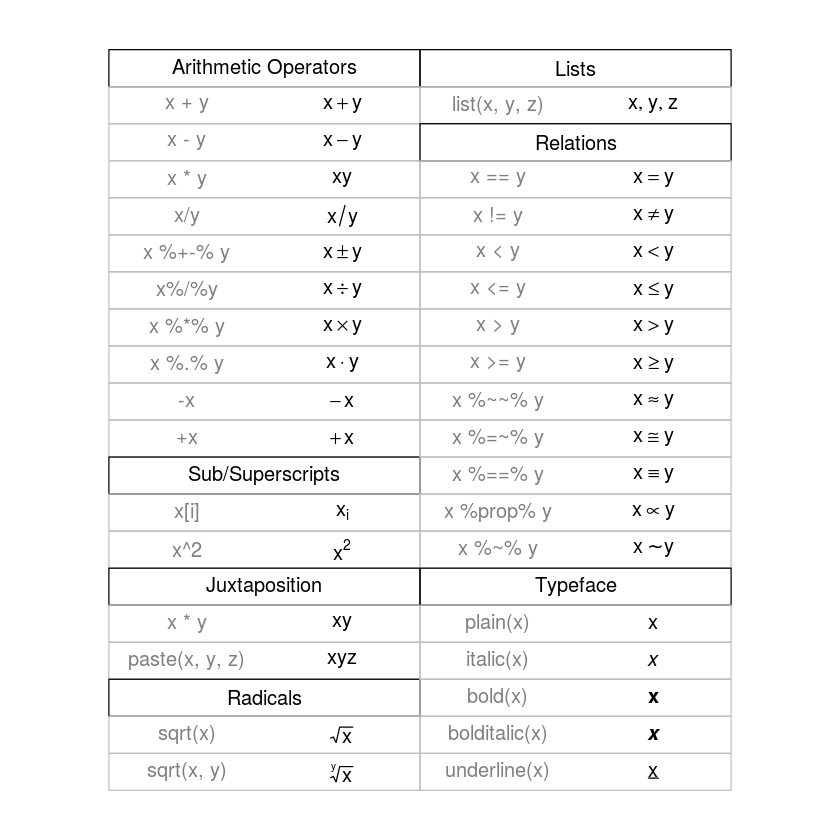
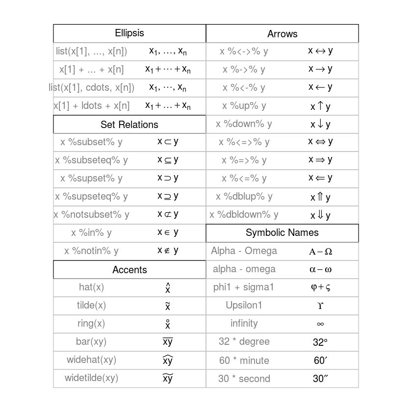
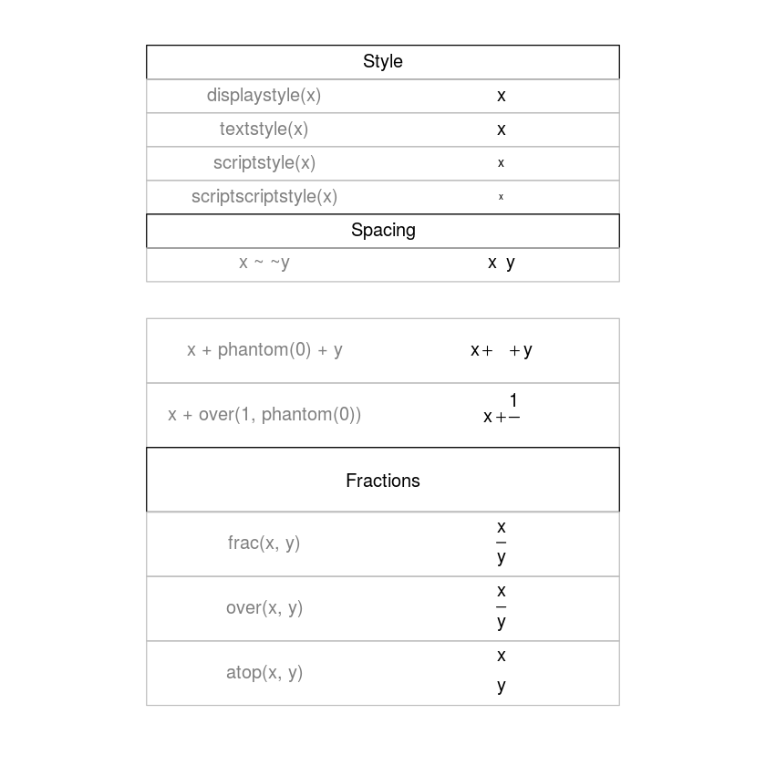
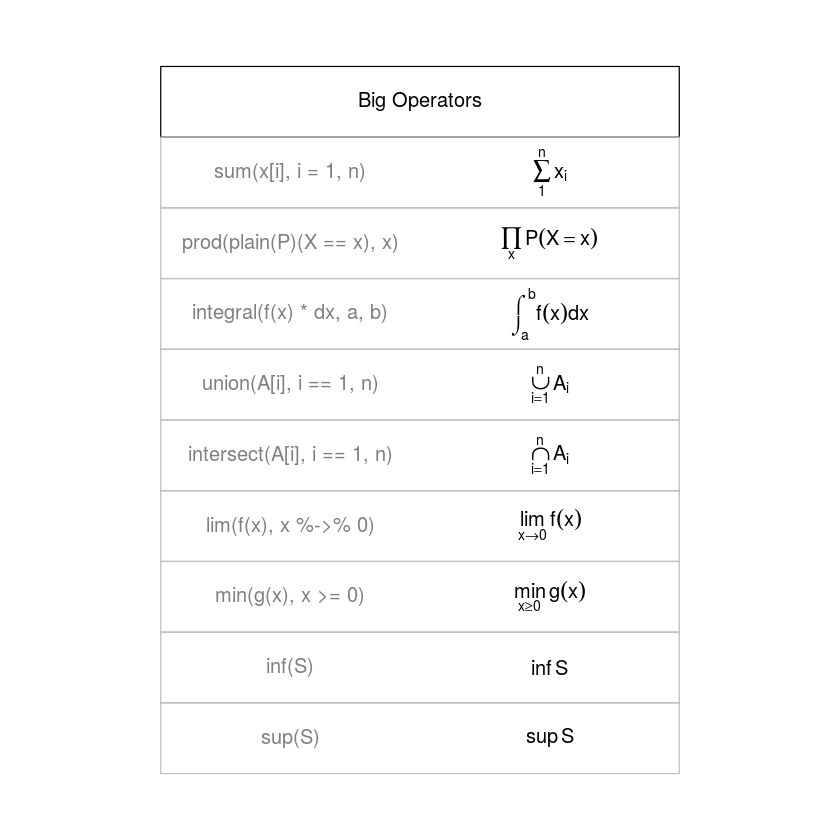
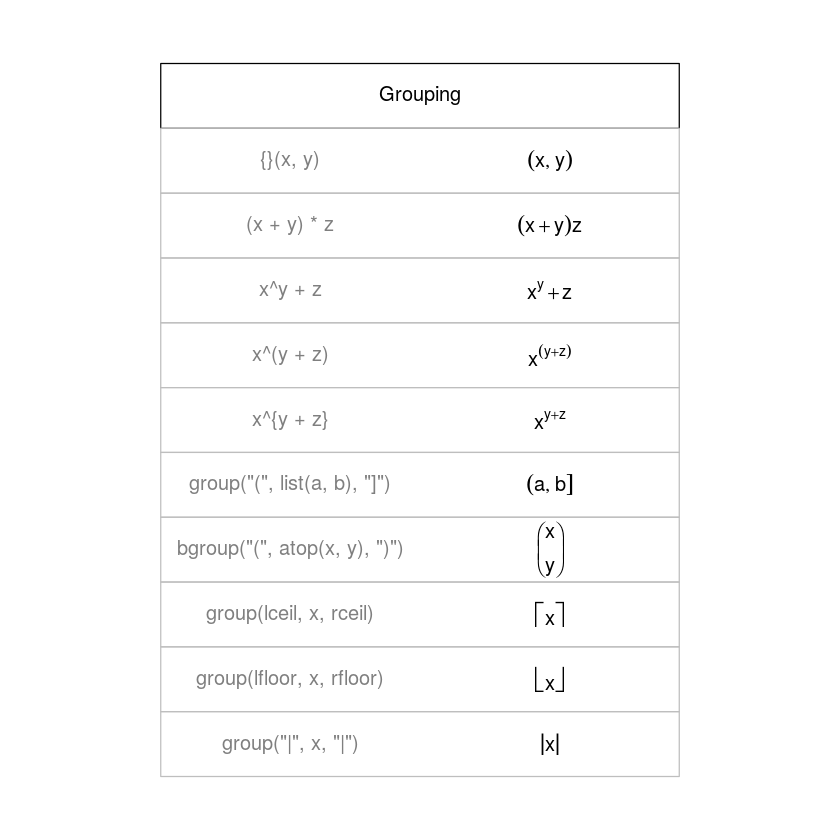

#                                             TAREA 1

## 1. Usa R para calcular la respuesta a lo siguiente:


```R
1+2*(3+4)
```


15


```R
4^3 + 3^(2+1)
```


91


```R
sqrt((4+3)*(2+1))
```


4.58257569495584


```R
((1+2)/(3+4))^2
```


0.183673469387755


## 2. Calcula de desviacion estándar desde el 0 al 100


```R
x=seq(0,100,by=1)
sd(x)
```


29.3001706479672


## 3. Ver la demostracion de simbolos matematicos


```R
demo(plotmath)
```

    
    
    	demo(plotmath)
    	---- ~~~~~~~~
    
    > #  Copyright (C) 2002-2016 The R Core Team
    > 
    > require(datasets)
    
    > require(grDevices); require(graphics)
    
    > ## --- "math annotation" in plots :
    > 
    > ######
    > # create tables of mathematical annotation functionality
    > ######
    > make.table <- function(nr, nc) {
    +     savepar <- par(mar=rep(0, 4), pty="s")
    +     plot(c(0, nc*2 + 1), c(0, -(nr + 1)),
    +          type="n", xlab="", ylab="", axes=FALSE)
    +     savepar
    + }
    
    > get.r <- function(i, nr) {
    +     i %% nr + 1
    + }
    
    > get.c <- function(i, nr) {
    +     i %/% nr + 1
    + }
    
    > draw.title.cell <- function(title, i, nr) {
    +     r <- get.r(i, nr)
    +     c <- get.c(i, nr)
    +     text(2*c - .5, -r, title)
    +     rect((2*(c - 1) + .5), -(r - .5), (2*c + .5), -(r + .5))
    + }
    
    > draw.plotmath.cell <- function(expr, i, nr, string = NULL) {
    +     r <- get.r(i, nr)
    +     c <- get.c(i, nr)
    +     if (is.null(string)) {
    +         string <- deparse(expr)
    +         string <- substr(string, 12, nchar(string) - 1)
    +     }
    +     text((2*(c - 1) + 1), -r, string, col="grey50")
    +     text((2*c), -r, expr, adj=c(.5,.5))
    +     rect((2*(c - 1) + .5), -(r - .5), (2*c + .5), -(r + .5), border="grey")
    + }
    
    > nr <- 20
    
    > nc <- 2
    
    > oldpar <- make.table(nr, nc)
    
    > i <- 0
    
    > draw.title.cell("Arithmetic Operators", i, nr); i <- i + 1
    
    > draw.plotmath.cell(expression(x + y), i, nr); i <- i + 1
    
    > draw.plotmath.cell(expression(x - y), i, nr); i <- i + 1
    
    > draw.plotmath.cell(expression(x * y), i, nr); i <- i + 1
    
    > draw.plotmath.cell(expression(x / y), i, nr); i <- i + 1
    
    > draw.plotmath.cell(expression(x %+-% y), i, nr); i <- i + 1
    
    > draw.plotmath.cell(expression(x %/% y), i, nr); i <- i + 1
    
    > draw.plotmath.cell(expression(x %*% y), i, nr); i <- i + 1
    
    > draw.plotmath.cell(expression(x %.% y), i, nr); i <- i + 1
    
    > draw.plotmath.cell(expression(-x), i, nr); i <- i + 1
    
    > draw.plotmath.cell(expression(+x), i, nr); i <- i + 1
    
    > draw.title.cell("Sub/Superscripts", i, nr); i <- i + 1
    
    > draw.plotmath.cell(expression(x[i]), i, nr); i <- i + 1
    
    > draw.plotmath.cell(expression(x^2), i, nr); i <- i + 1
    
    > draw.title.cell("Juxtaposition", i, nr); i <- i + 1
    
    > draw.plotmath.cell(expression(x * y), i, nr); i <- i + 1
    
    > draw.plotmath.cell(expression(paste(x, y, z)), i, nr); i <- i + 1
    
    > draw.title.cell("Radicals", i, nr); i <- i + 1
    
    > draw.plotmath.cell(expression(sqrt(x)), i, nr); i <- i + 1
    
    > draw.plotmath.cell(expression(sqrt(x, y)), i, nr); i <- i + 1
    
    > draw.title.cell("Lists", i, nr); i <- i + 1
    
    > draw.plotmath.cell(expression(list(x, y, z)), i, nr); i <- i + 1
    
    > draw.title.cell("Relations", i, nr); i <- i + 1
    
    > draw.plotmath.cell(expression(x == y), i, nr); i <- i + 1
    
    > draw.plotmath.cell(expression(x != y), i, nr); i <- i + 1
    
    > draw.plotmath.cell(expression(x < y), i, nr); i <- i + 1
    
    > draw.plotmath.cell(expression(x <= y), i, nr); i <- i + 1
    
    > draw.plotmath.cell(expression(x > y), i, nr); i <- i + 1
    
    > draw.plotmath.cell(expression(x >= y), i, nr); i <- i + 1
    
    > draw.plotmath.cell(expression(x %~~% y), i, nr); i <- i + 1
    
    > draw.plotmath.cell(expression(x %=~% y), i, nr); i <- i + 1
    
    > draw.plotmath.cell(expression(x %==% y), i, nr); i <- i + 1
    
    > draw.plotmath.cell(expression(x %prop% y), i, nr); i <- i + 1
    
    > draw.plotmath.cell(expression(x %~% y), i, nr); i <- i + 1
    
    > draw.title.cell("Typeface", i, nr); i <- i + 1
    
    > draw.plotmath.cell(expression(plain(x)), i, nr); i <- i + 1
    
    > draw.plotmath.cell(expression(italic(x)), i, nr); i <- i + 1
    
    > draw.plotmath.cell(expression(bold(x)), i, nr); i <- i + 1
    
    > draw.plotmath.cell(expression(bolditalic(x)), i, nr); i <- i + 1
    
    > draw.plotmath.cell(expression(underline(x)), i, nr); i <- i + 1
    
    > # Need fewer, wider columns for ellipsis ...
    > nr <- 20
    
    > nc <- 2
    
    > make.table(nr, nc)





    $mar
    [1] 0 0 0 0
    
    $pty
    [1] "s"
    
    
    > i <- 0
    
    > draw.title.cell("Ellipsis", i, nr); i <- i + 1
    
    > draw.plotmath.cell(expression(list(x[1], ..., x[n])), i, nr); i <- i + 1
    
    > draw.plotmath.cell(expression(x[1] + ... + x[n]), i, nr); i <- i + 1
    
    > draw.plotmath.cell(expression(list(x[1], cdots, x[n])), i, nr); i <- i + 1
    
    > draw.plotmath.cell(expression(x[1] + ldots + x[n]), i, nr); i <- i + 1
    
    > draw.title.cell("Set Relations", i, nr); i <- i + 1
    
    > draw.plotmath.cell(expression(x %subset% y), i, nr); i <- i + 1
    
    > draw.plotmath.cell(expression(x %subseteq% y), i, nr); i <- i + 1
    
    > draw.plotmath.cell(expression(x %supset% y), i, nr); i <- i + 1
    
    > draw.plotmath.cell(expression(x %supseteq% y), i, nr); i <- i + 1
    
    > draw.plotmath.cell(expression(x %notsubset% y), i, nr); i <- i + 1
    
    > draw.plotmath.cell(expression(x %in% y), i, nr); i <- i + 1
    
    > draw.plotmath.cell(expression(x %notin% y), i, nr); i <- i + 1
    
    > draw.title.cell("Accents", i, nr); i <- i + 1
    
    > draw.plotmath.cell(expression(hat(x)), i, nr); i <- i + 1
    
    > draw.plotmath.cell(expression(tilde(x)), i, nr); i <- i + 1
    
    > draw.plotmath.cell(expression(ring(x)), i, nr); i <- i + 1
    
    > draw.plotmath.cell(expression(bar(xy)), i, nr); i <- i + 1
    
    > draw.plotmath.cell(expression(widehat(xy)), i, nr); i <- i + 1
    
    > draw.plotmath.cell(expression(widetilde(xy)), i, nr); i <- i + 1
    
    > draw.title.cell("Arrows", i, nr); i <- i + 1
    
    > draw.plotmath.cell(expression(x %<->% y), i, nr); i <- i + 1
    
    > draw.plotmath.cell(expression(x %->% y), i, nr); i <- i + 1
    
    > draw.plotmath.cell(expression(x %<-% y), i, nr); i <- i + 1
    
    > draw.plotmath.cell(expression(x %up% y), i, nr); i <- i + 1
    
    > draw.plotmath.cell(expression(x %down% y), i, nr); i <- i + 1
    
    > draw.plotmath.cell(expression(x %<=>% y), i, nr); i <- i + 1
    
    > draw.plotmath.cell(expression(x %=>% y), i, nr); i <- i + 1
    
    > draw.plotmath.cell(expression(x %<=% y), i, nr); i <- i + 1
    
    > draw.plotmath.cell(expression(x %dblup% y), i, nr); i <- i + 1
    
    > draw.plotmath.cell(expression(x %dbldown% y), i, nr); i <- i + 1
    
    > draw.title.cell("Symbolic Names", i, nr); i <- i + 1
    
    > draw.plotmath.cell(expression(Alpha - Omega), i, nr); i <- i + 1
    
    > draw.plotmath.cell(expression(alpha - omega), i, nr); i <- i + 1
    
    > draw.plotmath.cell(expression(phi1 + sigma1), i, nr); i <- i + 1
    
    > draw.plotmath.cell(expression(Upsilon1), i, nr); i <- i + 1
    
    > draw.plotmath.cell(expression(infinity), i, nr); i <- i + 1
    
    > draw.plotmath.cell(expression(32 * degree), i, nr); i <- i + 1
    
    > draw.plotmath.cell(expression(60 * minute), i, nr); i <- i + 1
    
    > draw.plotmath.cell(expression(30 * second), i, nr); i <- i + 1
    
    > # Need even fewer, wider columns for typeface and style ...
    > nr <- 20
    
    > nc <- 1
    
    > make.table(nr, nc)
    $mar
    [1] 0 0 0 0
    
    $pty
    [1] "s"
    
    
    > i <- 0
    
    > draw.title.cell("Style", i, nr); i <- i + 1
    
    > draw.plotmath.cell(expression(displaystyle(x)), i, nr); i <- i + 1
    
    > draw.plotmath.cell(expression(textstyle(x)), i, nr); i <- i + 1
    
    > draw.plotmath.cell(expression(scriptstyle(x)), i, nr); i <- i + 1
    
    > draw.plotmath.cell(expression(scriptscriptstyle(x)), i, nr); i <- i + 1
    
    > draw.title.cell("Spacing", i, nr); i <- i + 1
    
    > draw.plotmath.cell(expression(x ~~ y), i, nr); i <- i + 1
    
    > # Need fewer, taller rows for fractions ...
    > # cheat a bit to save pages
    > par(new = TRUE)
    
    > nr <- 10
    
    > nc <- 1
    
    > make.table(nr, nc)





    $mar
    [1] 0 0 0 0
    
    $pty
    [1] "s"
    
    
    > i <- 4
    
    > draw.plotmath.cell(expression(x + phantom(0) + y), i, nr); i <- i + 1
    
    > draw.plotmath.cell(expression(x + over(1, phantom(0))), i, nr); i <- i + 1
    
    > draw.title.cell("Fractions", i, nr); i <- i + 1
    
    > draw.plotmath.cell(expression(frac(x, y)), i, nr); i <- i + 1
    
    > draw.plotmath.cell(expression(over(x, y)), i, nr); i <- i + 1
    
    > draw.plotmath.cell(expression(atop(x, y)), i, nr); i <- i + 1
    
    > # Need fewer, taller rows and fewer, wider columns for big operators ...
    > nr <- 10
    
    > nc <- 1
    
    > make.table(nr, nc)





    $mar
    [1] 0 0 0 0
    
    $pty
    [1] "s"
    
    
    > i <- 0
    
    > draw.title.cell("Big Operators", i, nr); i <- i + 1
    
    > draw.plotmath.cell(expression(sum(x[i], i=1, n)), i, nr); i <- i + 1
    
    > draw.plotmath.cell(expression(prod(plain(P)(X == x), x)), i, nr); i <- i + 1
    
    > draw.plotmath.cell(expression(integral(f(x) * dx, a, b)), i, nr); i <- i + 1
    
    > draw.plotmath.cell(expression(union(A[i], i==1, n)), i, nr); i <- i + 1
    
    > draw.plotmath.cell(expression(intersect(A[i], i==1, n)), i, nr); i <- i + 1
    
    > draw.plotmath.cell(expression(lim(f(x), x %->% 0)), i, nr); i <- i + 1
    
    > draw.plotmath.cell(expression(min(g(x), x >= 0)), i, nr); i <- i + 1
    
    > draw.plotmath.cell(expression(inf(S)), i, nr); i <- i + 1
    
    > draw.plotmath.cell(expression(sup(S)), i, nr); i <- i + 1
    
    > nr <- 11
    
    > make.table(nr, nc)





    $mar
    [1] 0 0 0 0
    
    $pty
    [1] "s"
    
    
    > i <- 0
    
    > draw.title.cell("Grouping", i, nr); i <- i + 1
    
    > # Those involving '{ . }' have to be done "by hand"
    > draw.plotmath.cell(expression({}(x , y)), i, nr, string="{}(x, y)"); i <- i + 1
    
    > draw.plotmath.cell(expression((x + y)*z), i, nr); i <- i + 1
    
    > draw.plotmath.cell(expression(x^y + z),   i, nr); i <- i + 1
    
    > draw.plotmath.cell(expression(x^(y + z)), i, nr); i <- i + 1
    
    > draw.plotmath.cell(expression(x^{y + z}), i, nr, string="x^{y + z}"); i <- i + 1
    
    > draw.plotmath.cell(expression(group("(", list(a, b), "]")), i, nr); i <- i + 1
    
    > draw.plotmath.cell(expression(bgroup("(", atop(x, y), ")")), i, nr); i <- i + 1
    
    > draw.plotmath.cell(expression(group(lceil, x, rceil)), i, nr); i <- i + 1
    
    > draw.plotmath.cell(expression(group(lfloor, x, rfloor)), i, nr); i <- i + 1
    
    > draw.plotmath.cell(expression(group("|", x, "|")), i, nr); i <- i + 1
    
    > par(oldpar)





## 4. Usa R para calcular lo siguiente:


```R
x=c(1,8,2,6,3,8,5,5,5,5)
#( x1 + x2 + · · · + x10 )/10
sum(x)/10
#Encontrar log10(x)  para cada i.
log10(x)
#Resolver ( x − 4.4 ) /2.875 para cada i.
(x- 4.4)/2.875
#Encontrar la diferencia, entre el mayor y menor x. (Eso es el rango).
max(x)-min(x)
```


4.8


<ol class=list-inline>
	<li>0</li>
	<li>0.903089986991944</li>
	<li>0.301029995663981</li>
	<li>0.778151250383644</li>
	<li>0.477121254719662</li>
	<li>0.903089986991944</li>
	<li>0.698970004336019</li>
	<li>0.698970004336019</li>
	<li>0.698970004336019</li>
	<li>0.698970004336019</li>
</ol>


<ol class=list-inline>
	<li>-1.18260869565217</li>
	<li>1.25217391304348</li>
	<li>-0.834782608695652</li>
	<li>0.556521739130435</li>
	<li>-0.486956521739131</li>
	<li>1.25217391304348</li>
	<li>0.208695652173913</li>
	<li>0.208695652173913</li>
	<li>0.208695652173913</li>
	<li>0.208695652173913</li>
</ol>


7


## 5. Escribe expresiones en R que generen vectores conteniendo las siguientes secuencias de vectores:


```R
# Las primeras 50 potencias de 3, empezando por 3^1
x=c(rep(3,50))
cumprod(x)

# 1, 2^2 ,3, 4^2 , 5, 6^2 , . . . 99, 100^2.
 y=seq(1,100,by=1)
 for(i in 1:100){
     if(i%%2==0)y[i]<-i*i
    }
 y
# 1, − 1, 2, − 1, 3, − 1, . . . , 20, − 1
  z= seq(2,41,by=1)
    for(i in 1:40){
     if(i%%2!=0)z[i]<-z[i]/2
     else z[i]<--1
         }
    z
```


<ol class=list-inline>
	<li>3</li>
	<li>9</li>
	<li>27</li>
	<li>81</li>
	<li>243</li>
	<li>729</li>
	<li>2187</li>
	<li>6561</li>
	<li>19683</li>
	<li>59049</li>
	<li>177147</li>
	<li>531441</li>
	<li>1594323</li>
	<li>4782969</li>
	<li>14348907</li>
	<li>43046721</li>
	<li>129140163</li>
	<li>387420489</li>
	<li>1162261467</li>
	<li>3486784401</li>
	<li>10460353203</li>
	<li>31381059609</li>
	<li>94143178827</li>
	<li>282429536481</li>
	<li>847288609443</li>
	<li>2541865828329</li>
	<li>7625597484987</li>
	<li>22876792454961</li>
	<li>68630377364883</li>
	<li>205891132094649</li>
	<li>617673396283947</li>
	<li>1853020188851841</li>
	<li>5559060566555523</li>
	<li>16677181699666568</li>
	<li>50031545098999704</li>
	<li>150094635296999136</li>
	<li>450283905890997376</li>
	<li>1350851717672992000</li>
	<li>4052555153018976256</li>
	<li>12157665459056928768</li>
	<li>36472996377170788352</li>
	<li>1.09418989131512e+20</li>
	<li>3.28256967394537e+20</li>
	<li>9.84770902183611e+20</li>
	<li>2.95431270655083e+21</li>
	<li>8.8629381196525e+21</li>
	<li>2.65888143589575e+22</li>
	<li>7.97664430768725e+22</li>
	<li>2.39299329230618e+23</li>
	<li>7.17897987691853e+23</li>
</ol>


<ol class=list-inline>
	<li>1</li>
	<li>4</li>
	<li>3</li>
	<li>16</li>
	<li>5</li>
	<li>36</li>
	<li>7</li>
	<li>64</li>
	<li>9</li>
	<li>100</li>
	<li>11</li>
	<li>144</li>
	<li>13</li>
	<li>196</li>
	<li>15</li>
	<li>256</li>
	<li>17</li>
	<li>324</li>
	<li>19</li>
	<li>400</li>
	<li>21</li>
	<li>484</li>
	<li>23</li>
	<li>576</li>
	<li>25</li>
	<li>676</li>
	<li>27</li>
	<li>784</li>
	<li>29</li>
	<li>900</li>
	<li>31</li>
	<li>1024</li>
	<li>33</li>
	<li>1156</li>
	<li>35</li>
	<li>1296</li>
	<li>37</li>
	<li>1444</li>
	<li>39</li>
	<li>1600</li>
	<li>41</li>
	<li>1764</li>
	<li>43</li>
	<li>1936</li>
	<li>45</li>
	<li>2116</li>
	<li>47</li>
	<li>2304</li>
	<li>49</li>
	<li>2500</li>
	<li>51</li>
	<li>2704</li>
	<li>53</li>
	<li>2916</li>
	<li>55</li>
	<li>3136</li>
	<li>57</li>
	<li>3364</li>
	<li>59</li>
	<li>3600</li>
	<li>61</li>
	<li>3844</li>
	<li>63</li>
	<li>4096</li>
	<li>65</li>
	<li>4356</li>
	<li>67</li>
	<li>4624</li>
	<li>69</li>
	<li>4900</li>
	<li>71</li>
	<li>5184</li>
	<li>73</li>
	<li>5476</li>
	<li>75</li>
	<li>5776</li>
	<li>77</li>
	<li>6084</li>
	<li>79</li>
	<li>6400</li>
	<li>81</li>
	<li>6724</li>
	<li>83</li>
	<li>7056</li>
	<li>85</li>
	<li>7396</li>
	<li>87</li>
	<li>7744</li>
	<li>89</li>
	<li>8100</li>
	<li>91</li>
	<li>8464</li>
	<li>93</li>
	<li>8836</li>
	<li>95</li>
	<li>9216</li>
	<li>97</li>
	<li>9604</li>
	<li>99</li>
	<li>10000</li>
</ol>


<ol class=list-inline>
	<li>1</li>
	<li>-1</li>
	<li>2</li>
	<li>-1</li>
	<li>3</li>
	<li>-1</li>
	<li>4</li>
	<li>-1</li>
	<li>5</li>
	<li>-1</li>
	<li>6</li>
	<li>-1</li>
	<li>7</li>
	<li>-1</li>
	<li>8</li>
	<li>-1</li>
	<li>9</li>
	<li>-1</li>
	<li>10</li>
	<li>-1</li>
	<li>11</li>
	<li>-1</li>
	<li>12</li>
	<li>-1</li>
	<li>13</li>
	<li>-1</li>
	<li>14</li>
	<li>-1</li>
	<li>15</li>
	<li>-1</li>
	<li>16</li>
	<li>-1</li>
	<li>17</li>
	<li>-1</li>
	<li>18</li>
	<li>-1</li>
	<li>19</li>
	<li>-1</li>
	<li>20</li>
	<li>-1</li>
</ol>


