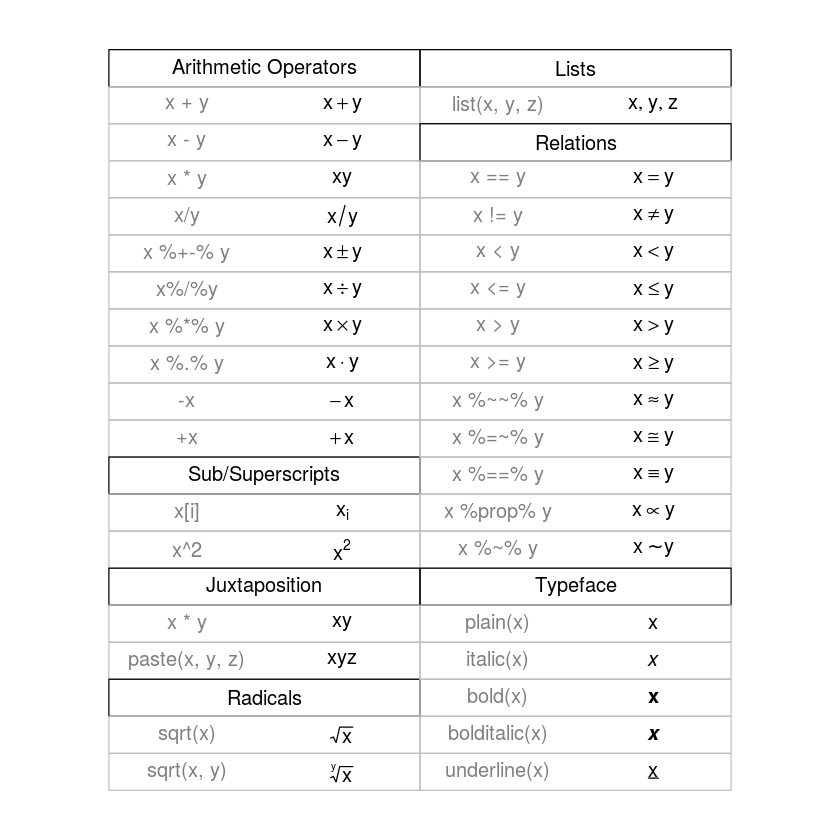
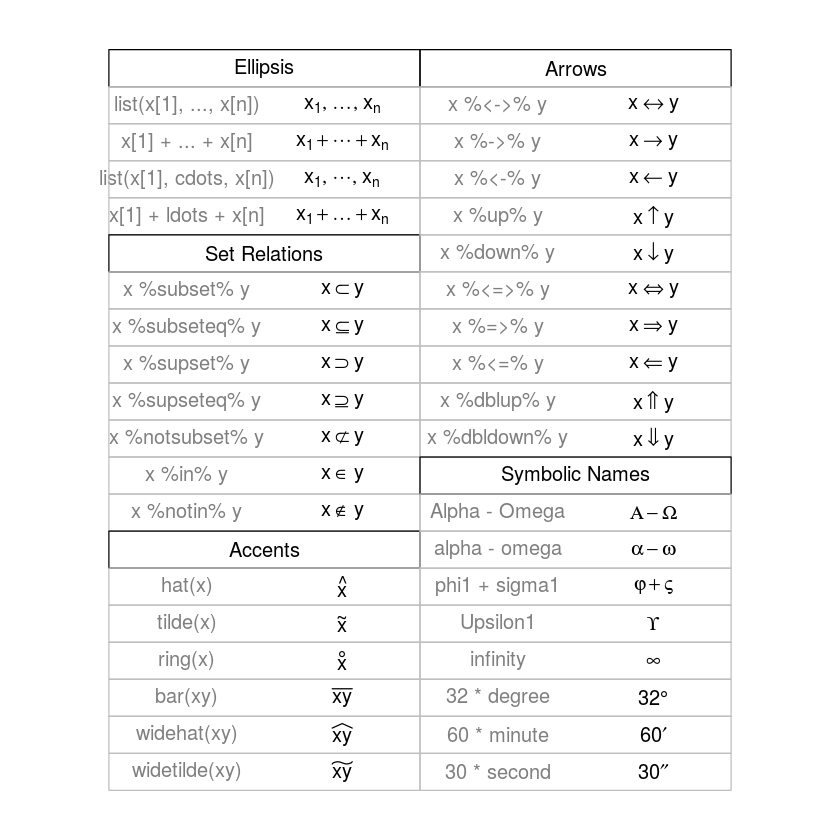
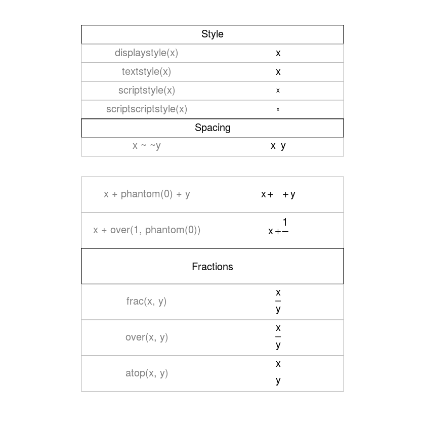
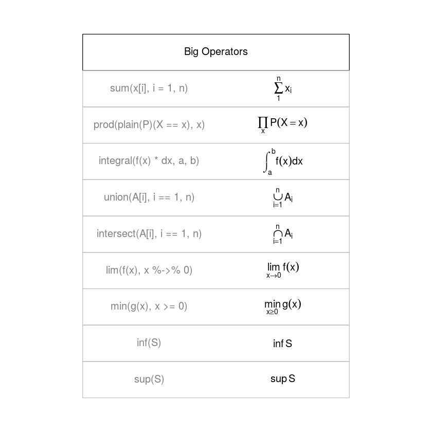
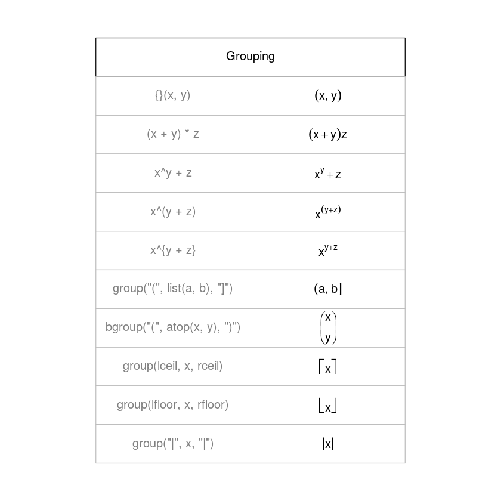

#                                             TAREA 1

## 1. Usa R para calcular la respuesta a lo siguiente:


```R
1+2*(3+4)
```


15


```R
4^3 + 3^(2+1)
```


91


```R
sqrt((4+3)*(2+1))
```


4.58257569495584


```R
((1+2)/(3+4))^2
```


0.183673469387755


## 2. Calcula de desviacion estándar desde el 0 al 100


```R
x=seq(0,100,by=1)
sd(x)
```


29.3001706479672


## 3. Ver la demostracion de simbolos matematicos


```R
demo(plotmath)
```

    
    
    	demo(plotmath)
    	---- ~~~~~~~~
    
    > #  Copyright (C) 2002-2016 The R Core Team
    > 
    > require(datasets)
    
    > require(grDevices); require(graphics)
    
    > ## --- "math annotation" in plots :
    > 
    > ######
    > # create tables of mathematical annotation functionality
    > ######
    > make.table <- function(nr, nc) {
    +     savepar <- par(mar=rep(0, 4), pty="s")
    +     plot(c(0, nc*2 + 1), c(0, -(nr + 1)),
    +          type="n", xlab="", ylab="", axes=FALSE)
    +     savepar
    + }
    
    > get.r <- function(i, nr) {
    +     i %% nr + 1
    + }
    
    > get.c <- function(i, nr) {
    +     i %/% nr + 1
    + }
    
    > draw.title.cell <- function(title, i, nr) {
    +     r <- get.r(i, nr)
    +     c <- get.c(i, nr)
    +     text(2*c - .5, -r, title)
    +     rect((2*(c - 1) + .5), -(r - .5), (2*c + .5), -(r + .5))
    + }
    
    > draw.plotmath.cell <- function(expr, i, nr, string = NULL) {
    +     r <- get.r(i, nr)
    +     c <- get.c(i, nr)
    +     if (is.null(string)) {
    +         string <- deparse(expr)
    +         string <- substr(string, 12, nchar(string) - 1)
    +     }
    +     text((2*(c - 1) + 1), -r, string, col="grey50")
    +     text((2*c), -r, expr, adj=c(.5,.5))
    +     rect((2*(c - 1) + .5), -(r - .5), (2*c + .5), -(r + .5), border="grey")
    + }
    
    > nr <- 20
    
    > nc <- 2
    
    > oldpar <- make.table(nr, nc)
    
    > i <- 0
    
    > draw.title.cell("Arithmetic Operators", i, nr); i <- i + 1
    
    > draw.plotmath.cell(expression(x + y), i, nr); i <- i + 1
    
    > draw.plotmath.cell(expression(x - y), i, nr); i <- i + 1
    
    > draw.plotmath.cell(expression(x * y), i, nr); i <- i + 1
    
    > draw.plotmath.cell(expression(x / y), i, nr); i <- i + 1
    
    > draw.plotmath.cell(expression(x %+-% y), i, nr); i <- i + 1
    
    > draw.plotmath.cell(expression(x %/% y), i, nr); i <- i + 1
    
    > draw.plotmath.cell(expression(x %*% y), i, nr); i <- i + 1
    
    > draw.plotmath.cell(expression(x %.% y), i, nr); i <- i + 1
    
    > draw.plotmath.cell(expression(-x), i, nr); i <- i + 1
    
    > draw.plotmath.cell(expression(+x), i, nr); i <- i + 1
    
    > draw.title.cell("Sub/Superscripts", i, nr); i <- i + 1
    
    > draw.plotmath.cell(expression(x[i]), i, nr); i <- i + 1
    
    > draw.plotmath.cell(expression(x^2), i, nr); i <- i + 1
    
    > draw.title.cell("Juxtaposition", i, nr); i <- i + 1
    
    > draw.plotmath.cell(expression(x * y), i, nr); i <- i + 1
    
    > draw.plotmath.cell(expression(paste(x, y, z)), i, nr); i <- i + 1
    
    > draw.title.cell("Radicals", i, nr); i <- i + 1
    
    > draw.plotmath.cell(expression(sqrt(x)), i, nr); i <- i + 1
    
    > draw.plotmath.cell(expression(sqrt(x, y)), i, nr); i <- i + 1
    
    > draw.title.cell("Lists", i, nr); i <- i + 1
    
    > draw.plotmath.cell(expression(list(x, y, z)), i, nr); i <- i + 1
    
    > draw.title.cell("Relations", i, nr); i <- i + 1
    
    > draw.plotmath.cell(expression(x == y), i, nr); i <- i + 1
    
    > draw.plotmath.cell(expression(x != y), i, nr); i <- i + 1
    
    > draw.plotmath.cell(expression(x < y), i, nr); i <- i + 1
    
    > draw.plotmath.cell(expression(x <= y), i, nr); i <- i + 1
    
    > draw.plotmath.cell(expression(x > y), i, nr); i <- i + 1
    
    > draw.plotmath.cell(expression(x >= y), i, nr); i <- i + 1
    
    > draw.plotmath.cell(expression(x %~~% y), i, nr); i <- i + 1
    
    > draw.plotmath.cell(expression(x %=~% y), i, nr); i <- i + 1
    
    > draw.plotmath.cell(expression(x %==% y), i, nr); i <- i + 1
    
    > draw.plotmath.cell(expression(x %prop% y), i, nr); i <- i + 1
    
    > draw.plotmath.cell(expression(x %~% y), i, nr); i <- i + 1
    
    > draw.title.cell("Typeface", i, nr); i <- i + 1
    
    > draw.plotmath.cell(expression(plain(x)), i, nr); i <- i + 1
    
    > draw.plotmath.cell(expression(italic(x)), i, nr); i <- i + 1
    
    > draw.plotmath.cell(expression(bold(x)), i, nr); i <- i + 1
    
    > draw.plotmath.cell(expression(bolditalic(x)), i, nr); i <- i + 1
    
    > draw.plotmath.cell(expression(underline(x)), i, nr); i <- i + 1
    
    > # Need fewer, wider columns for ellipsis ...
    > nr <- 20
    
    > nc <- 2
    
    > make.table(nr, nc)





    $mar
    [1] 0 0 0 0
    
    $pty
    [1] "s"
    
    
    > i <- 0
    
    > draw.title.cell("Ellipsis", i, nr); i <- i + 1
    
    > draw.plotmath.cell(expression(list(x[1], ..., x[n])), i, nr); i <- i + 1
    
    > draw.plotmath.cell(expression(x[1] + ... + x[n]), i, nr); i <- i + 1
    
    > draw.plotmath.cell(expression(list(x[1], cdots, x[n])), i, nr); i <- i + 1
    
    > draw.plotmath.cell(expression(x[1] + ldots + x[n]), i, nr); i <- i + 1
    
    > draw.title.cell("Set Relations", i, nr); i <- i + 1
    
    > draw.plotmath.cell(expression(x %subset% y), i, nr); i <- i + 1
    
    > draw.plotmath.cell(expression(x %subseteq% y), i, nr); i <- i + 1
    
    > draw.plotmath.cell(expression(x %supset% y), i, nr); i <- i + 1
    
    > draw.plotmath.cell(expression(x %supseteq% y), i, nr); i <- i + 1
    
    > draw.plotmath.cell(expression(x %notsubset% y), i, nr); i <- i + 1
    
    > draw.plotmath.cell(expression(x %in% y), i, nr); i <- i + 1
    
    > draw.plotmath.cell(expression(x %notin% y), i, nr); i <- i + 1
    
    > draw.title.cell("Accents", i, nr); i <- i + 1
    
    > draw.plotmath.cell(expression(hat(x)), i, nr); i <- i + 1
    
    > draw.plotmath.cell(expression(tilde(x)), i, nr); i <- i + 1
    
    > draw.plotmath.cell(expression(ring(x)), i, nr); i <- i + 1
    
    > draw.plotmath.cell(expression(bar(xy)), i, nr); i <- i + 1
    
    > draw.plotmath.cell(expression(widehat(xy)), i, nr); i <- i + 1
    
    > draw.plotmath.cell(expression(widetilde(xy)), i, nr); i <- i + 1
    
    > draw.title.cell("Arrows", i, nr); i <- i + 1
    
    > draw.plotmath.cell(expression(x %<->% y), i, nr); i <- i + 1
    
    > draw.plotmath.cell(expression(x %->% y), i, nr); i <- i + 1
    
    > draw.plotmath.cell(expression(x %<-% y), i, nr); i <- i + 1
    
    > draw.plotmath.cell(expression(x %up% y), i, nr); i <- i + 1
    
    > draw.plotmath.cell(expression(x %down% y), i, nr); i <- i + 1
    
    > draw.plotmath.cell(expression(x %<=>% y), i, nr); i <- i + 1
    
    > draw.plotmath.cell(expression(x %=>% y), i, nr); i <- i + 1
    
    > draw.plotmath.cell(expression(x %<=% y), i, nr); i <- i + 1
    
    > draw.plotmath.cell(expression(x %dblup% y), i, nr); i <- i + 1
    
    > draw.plotmath.cell(expression(x %dbldown% y), i, nr); i <- i + 1
    
    > draw.title.cell("Symbolic Names", i, nr); i <- i + 1
    
    > draw.plotmath.cell(expression(Alpha - Omega), i, nr); i <- i + 1
    
    > draw.plotmath.cell(expression(alpha - omega), i, nr); i <- i + 1
    
    > draw.plotmath.cell(expression(phi1 + sigma1), i, nr); i <- i + 1
    
    > draw.plotmath.cell(expression(Upsilon1), i, nr); i <- i + 1
    
    > draw.plotmath.cell(expression(infinity), i, nr); i <- i + 1
    
    > draw.plotmath.cell(expression(32 * degree), i, nr); i <- i + 1
    
    > draw.plotmath.cell(expression(60 * minute), i, nr); i <- i + 1
    
    > draw.plotmath.cell(expression(30 * second), i, nr); i <- i + 1
    
    > # Need even fewer, wider columns for typeface and style ...
    > nr <- 20
    
    > nc <- 1
    
    > make.table(nr, nc)
    $mar
    [1] 0 0 0 0
    
    $pty
    [1] "s"
    
    
    > i <- 0
    
    > draw.title.cell("Style", i, nr); i <- i + 1
    
    > draw.plotmath.cell(expression(displaystyle(x)), i, nr); i <- i + 1
    
    > draw.plotmath.cell(expression(textstyle(x)), i, nr); i <- i + 1
    
    > draw.plotmath.cell(expression(scriptstyle(x)), i, nr); i <- i + 1
    
    > draw.plotmath.cell(expression(scriptscriptstyle(x)), i, nr); i <- i + 1
    
    > draw.title.cell("Spacing", i, nr); i <- i + 1
    
    > draw.plotmath.cell(expression(x ~~ y), i, nr); i <- i + 1
    
    > # Need fewer, taller rows for fractions ...
    > # cheat a bit to save pages
    > par(new = TRUE)
    
    > nr <- 10
    
    > nc <- 1
    
    > make.table(nr, nc)





    $mar
    [1] 0 0 0 0
    
    $pty
    [1] "s"
    
    
    > i <- 4
    
    > draw.plotmath.cell(expression(x + phantom(0) + y), i, nr); i <- i + 1
    
    > draw.plotmath.cell(expression(x + over(1, phantom(0))), i, nr); i <- i + 1
    
    > draw.title.cell("Fractions", i, nr); i <- i + 1
    
    > draw.plotmath.cell(expression(frac(x, y)), i, nr); i <- i + 1
    
    > draw.plotmath.cell(expression(over(x, y)), i, nr); i <- i + 1
    
    > draw.plotmath.cell(expression(atop(x, y)), i, nr); i <- i + 1
    
    > # Need fewer, taller rows and fewer, wider columns for big operators ...
    > nr <- 10
    
    > nc <- 1
    
    > make.table(nr, nc)





    $mar
    [1] 0 0 0 0
    
    $pty
    [1] "s"
    
    
    > i <- 0
    
    > draw.title.cell("Big Operators", i, nr); i <- i + 1
    
    > draw.plotmath.cell(expression(sum(x[i], i=1, n)), i, nr); i <- i + 1
    
    > draw.plotmath.cell(expression(prod(plain(P)(X == x), x)), i, nr); i <- i + 1
    
    > draw.plotmath.cell(expression(integral(f(x) * dx, a, b)), i, nr); i <- i + 1
    
    > draw.plotmath.cell(expression(union(A[i], i==1, n)), i, nr); i <- i + 1
    
    > draw.plotmath.cell(expression(intersect(A[i], i==1, n)), i, nr); i <- i + 1
    
    > draw.plotmath.cell(expression(lim(f(x), x %->% 0)), i, nr); i <- i + 1
    
    > draw.plotmath.cell(expression(min(g(x), x >= 0)), i, nr); i <- i + 1
    
    > draw.plotmath.cell(expression(inf(S)), i, nr); i <- i + 1
    
    > draw.plotmath.cell(expression(sup(S)), i, nr); i <- i + 1
    
    > nr <- 11
    
    > make.table(nr, nc)





    $mar
    [1] 0 0 0 0
    
    $pty
    [1] "s"
    
    
    > i <- 0
    
    > draw.title.cell("Grouping", i, nr); i <- i + 1
    
    > # Those involving '{ . }' have to be done "by hand"
    > draw.plotmath.cell(expression({}(x , y)), i, nr, string="{}(x, y)"); i <- i + 1
    
    > draw.plotmath.cell(expression((x + y)*z), i, nr); i <- i + 1
    
    > draw.plotmath.cell(expression(x^y + z),   i, nr); i <- i + 1
    
    > draw.plotmath.cell(expression(x^(y + z)), i, nr); i <- i + 1
    
    > draw.plotmath.cell(expression(x^{y + z}), i, nr, string="x^{y + z}"); i <- i + 1
    
    > draw.plotmath.cell(expression(group("(", list(a, b), "]")), i, nr); i <- i + 1
    
    > draw.plotmath.cell(expression(bgroup("(", atop(x, y), ")")), i, nr); i <- i + 1
    
    > draw.plotmath.cell(expression(group(lceil, x, rceil)), i, nr); i <- i + 1
    
    > draw.plotmath.cell(expression(group(lfloor, x, rfloor)), i, nr); i <- i + 1
    
    > draw.plotmath.cell(expression(group("|", x, "|")), i, nr); i <- i + 1
    
    > par(oldpar)





## 4. Usa R para calcular lo siguiente:


```R
x=c(1,8,2,6,3,8,5,5,5,5)
#( x1 + x2 + · · · + x10 )/10
sum(x)/10
#Encontrar log10(x)  para cada i.
log10(x)
#Resolver ( x − 4.4 ) /2.875 para cada i.
(x- 4.4)/2.875
#Encontrar la diferencia, entre el mayor y menor x. (Eso es el rango).
max(x)-min(x)
```


4.8


<ol class=list-inline>
	<li>0</li>
	<li>0.903089986991944</li>
	<li>0.301029995663981</li>
	<li>0.778151250383644</li>
	<li>0.477121254719662</li>
	<li>0.903089986991944</li>
	<li>0.698970004336019</li>
	<li>0.698970004336019</li>
	<li>0.698970004336019</li>
	<li>0.698970004336019</li>
</ol>


<ol class=list-inline>
	<li>-1.18260869565217</li>
	<li>1.25217391304348</li>
	<li>-0.834782608695652</li>
	<li>0.556521739130435</li>
	<li>-0.486956521739131</li>
	<li>1.25217391304348</li>
	<li>0.208695652173913</li>
	<li>0.208695652173913</li>
	<li>0.208695652173913</li>
	<li>0.208695652173913</li>
</ol>


7


## 5. Escribe expresiones en R que generen vectores conteniendo las siguientes secuencias de vectores:


```R
# Las primeras 50 potencias de 3, empezando por 3^1
x=c(rep(3,50))
cumprod(x)

# 1, 2^2 ,3, 4^2 , 5, 6^2 , . . . 99, 100^2.
 y=seq(1,100,by=1)
 for(i in 1:100){
     if(i%%2==0)y[i]<-i*i
    }
 y
# 1, − 1, 2, − 1, 3, − 1, . . . , 20, − 1
  z= seq(2,41,by=1)
    for(i in 1:40){
     if(i%%2!=0)z[i]<-z[i]/2
     else z[i]<--1
         }
    z
```


<ol class=list-inline>
	<li>3</li>
	<li>9</li>
	<li>27</li>
	<li>81</li>
	<li>243</li>
	<li>729</li>
	<li>2187</li>
	<li>6561</li>
	<li>19683</li>
	<li>59049</li>
	<li>177147</li>
	<li>531441</li>
	<li>1594323</li>
	<li>4782969</li>
	<li>14348907</li>
	<li>43046721</li>
	<li>129140163</li>
	<li>387420489</li>
	<li>1162261467</li>
	<li>3486784401</li>
	<li>10460353203</li>
	<li>31381059609</li>
	<li>94143178827</li>
	<li>282429536481</li>
	<li>847288609443</li>
	<li>2541865828329</li>
	<li>7625597484987</li>
	<li>22876792454961</li>
	<li>68630377364883</li>
	<li>205891132094649</li>
	<li>617673396283947</li>
	<li>1853020188851841</li>
	<li>5559060566555523</li>
	<li>16677181699666568</li>
	<li>50031545098999704</li>
	<li>150094635296999136</li>
	<li>450283905890997376</li>
	<li>1350851717672992000</li>
	<li>4052555153018976256</li>
	<li>12157665459056928768</li>
	<li>36472996377170788352</li>
	<li>1.09418989131512e+20</li>
	<li>3.28256967394537e+20</li>
	<li>9.84770902183611e+20</li>
	<li>2.95431270655083e+21</li>
	<li>8.8629381196525e+21</li>
	<li>2.65888143589575e+22</li>
	<li>7.97664430768725e+22</li>
	<li>2.39299329230618e+23</li>
	<li>7.17897987691853e+23</li>
</ol>


<ol class=list-inline>
	<li>1</li>
	<li>4</li>
	<li>3</li>
	<li>16</li>
	<li>5</li>
	<li>36</li>
	<li>7</li>
	<li>64</li>
	<li>9</li>
	<li>100</li>
	<li>11</li>
	<li>144</li>
	<li>13</li>
	<li>196</li>
	<li>15</li>
	<li>256</li>
	<li>17</li>
	<li>324</li>
	<li>19</li>
	<li>400</li>
	<li>21</li>
	<li>484</li>
	<li>23</li>
	<li>576</li>
	<li>25</li>
	<li>676</li>
	<li>27</li>
	<li>784</li>
	<li>29</li>
	<li>900</li>
	<li>31</li>
	<li>1024</li>
	<li>33</li>
	<li>1156</li>
	<li>35</li>
	<li>1296</li>
	<li>37</li>
	<li>1444</li>
	<li>39</li>
	<li>1600</li>
	<li>41</li>
	<li>1764</li>
	<li>43</li>
	<li>1936</li>
	<li>45</li>
	<li>2116</li>
	<li>47</li>
	<li>2304</li>
	<li>49</li>
	<li>2500</li>
	<li>51</li>
	<li>2704</li>
	<li>53</li>
	<li>2916</li>
	<li>55</li>
	<li>3136</li>
	<li>57</li>
	<li>3364</li>
	<li>59</li>
	<li>3600</li>
	<li>61</li>
	<li>3844</li>
	<li>63</li>
	<li>4096</li>
	<li>65</li>
	<li>4356</li>
	<li>67</li>
	<li>4624</li>
	<li>69</li>
	<li>4900</li>
	<li>71</li>
	<li>5184</li>
	<li>73</li>
	<li>5476</li>
	<li>75</li>
	<li>5776</li>
	<li>77</li>
	<li>6084</li>
	<li>79</li>
	<li>6400</li>
	<li>81</li>
	<li>6724</li>
	<li>83</li>
	<li>7056</li>
	<li>85</li>
	<li>7396</li>
	<li>87</li>
	<li>7744</li>
	<li>89</li>
	<li>8100</li>
	<li>91</li>
	<li>8464</li>
	<li>93</li>
	<li>8836</li>
	<li>95</li>
	<li>9216</li>
	<li>97</li>
	<li>9604</li>
	<li>99</li>
	<li>10000</li>
</ol>


<ol class=list-inline>
	<li>1</li>
	<li>-1</li>
	<li>2</li>
	<li>-1</li>
	<li>3</li>
	<li>-1</li>
	<li>4</li>
	<li>-1</li>
	<li>5</li>
	<li>-1</li>
	<li>6</li>
	<li>-1</li>
	<li>7</li>
	<li>-1</li>
	<li>8</li>
	<li>-1</li>
	<li>9</li>
	<li>-1</li>
	<li>10</li>
	<li>-1</li>
	<li>11</li>
	<li>-1</li>
	<li>12</li>
	<li>-1</li>
	<li>13</li>
	<li>-1</li>
	<li>14</li>
	<li>-1</li>
	<li>15</li>
	<li>-1</li>
	<li>16</li>
	<li>-1</li>
	<li>17</li>
	<li>-1</li>
	<li>18</li>
	<li>-1</li>
	<li>19</li>
	<li>-1</li>
	<li>20</li>
	<li>-1</li>
</ol>


## 6. Los siguientes son una muestra de observaciones sobre la radiación solar entrante en un invernadero:


```R
# a) Asigna los datos a un objeto solar.radiacion.
    solar.radiacion = c(11.1,10.6,6.3,8.8,10.7,11.2,8.9,12.2)
    
# b) Encontrar la media, mediana y la varianza de las observaciones obtenidas sobre la radiación
#solar.
    mean(solar.radiacion)
    median(solar.radiacion)
    var(solar.radiacion)
    
# c) Agregar 10 a cada observación de solar.radiacion y asigna el resultado a sr10 . Encontrar la
#  media, la mediana y la varianza de sr10 . Cuál de las estadística cambia y por cuanto?.
    sr10=solar.radiacion+10
    mean(sr10)
    median(sr10)
    var(sr10)
#  Cambian la media y la mediana,ambas aumentan en 10 unidades.
# d) Multiplica cada observación por -2 y asigna el valor a srm2 . Encontrar la media, la mediana y
#  la varianza de srm2.Como  las estadisticas cambian?
    srm2= solar.radiacion*-2
    mean(srm2)
    median(srm2)
    var(srm2)
# Todas las estadisticas cambian!


```


9.975


10.65


3.525


19.975


20.65


3.525


-19.95


-21.3


14.1


## 7.El conjunto de datos rivers se carga cuando R empieza. Mira los datos escribiendo su nombre y luego la tecla de retorno. ¿Cuál es el último valor listado?.


```R
rivers
#El ultimo valor listado 1770
```


<ol class=list-inline>
	<li>735</li>
	<li>320</li>
	<li>325</li>
	<li>392</li>
	<li>524</li>
	<li>450</li>
	<li>1459</li>
	<li>135</li>
	<li>465</li>
	<li>600</li>
	<li>330</li>
	<li>336</li>
	<li>280</li>
	<li>315</li>
	<li>870</li>
	<li>906</li>
	<li>202</li>
	<li>329</li>
	<li>290</li>
	<li>1000</li>
	<li>600</li>
	<li>505</li>
	<li>1450</li>
	<li>840</li>
	<li>1243</li>
	<li>890</li>
	<li>350</li>
	<li>407</li>
	<li>286</li>
	<li>280</li>
	<li>525</li>
	<li>720</li>
	<li>390</li>
	<li>250</li>
	<li>327</li>
	<li>230</li>
	<li>265</li>
	<li>850</li>
	<li>210</li>
	<li>630</li>
	<li>260</li>
	<li>230</li>
	<li>360</li>
	<li>730</li>
	<li>600</li>
	<li>306</li>
	<li>390</li>
	<li>420</li>
	<li>291</li>
	<li>710</li>
	<li>340</li>
	<li>217</li>
	<li>281</li>
	<li>352</li>
	<li>259</li>
	<li>250</li>
	<li>470</li>
	<li>680</li>
	<li>570</li>
	<li>350</li>
	<li>300</li>
	<li>560</li>
	<li>900</li>
	<li>625</li>
	<li>332</li>
	<li>2348</li>
	<li>1171</li>
	<li>3710</li>
	<li>2315</li>
	<li>2533</li>
	<li>780</li>
	<li>280</li>
	<li>410</li>
	<li>460</li>
	<li>260</li>
	<li>255</li>
	<li>431</li>
	<li>350</li>
	<li>760</li>
	<li>618</li>
	<li>338</li>
	<li>981</li>
	<li>1306</li>
	<li>500</li>
	<li>696</li>
	<li>605</li>
	<li>250</li>
	<li>411</li>
	<li>1054</li>
	<li>735</li>
	<li>233</li>
	<li>435</li>
	<li>490</li>
	<li>310</li>
	<li>460</li>
	<li>383</li>
	<li>375</li>
	<li>1270</li>
	<li>545</li>
	<li>445</li>
	<li>1885</li>
	<li>380</li>
	<li>300</li>
	<li>380</li>
	<li>377</li>
	<li>425</li>
	<li>276</li>
	<li>210</li>
	<li>800</li>
	<li>420</li>
	<li>350</li>
	<li>360</li>
	<li>538</li>
	<li>1100</li>
	<li>1205</li>
	<li>314</li>
	<li>237</li>
	<li>610</li>
	<li>360</li>
	<li>540</li>
	<li>1038</li>
	<li>424</li>
	<li>310</li>
	<li>300</li>
	<li>444</li>
	<li>301</li>
	<li>268</li>
	<li>620</li>
	<li>215</li>
	<li>652</li>
	<li>900</li>
	<li>525</li>
	<li>246</li>
	<li>360</li>
	<li>529</li>
	<li>500</li>
	<li>720</li>
	<li>270</li>
	<li>430</li>
	<li>671</li>
	<li>1770</li>
</ol>


## 8. El conjunto de datos Orange se almacena como un data frame con tres variables. ¿Cuáles son esas tres variables?.


```R
Orange
# Las variables son Tree,age,circunference
```


<table>
<thead><tr><th scope=col>Tree</th><th scope=col>age</th><th scope=col>circumference</th></tr></thead>
<tbody>
	<tr><td>1   </td><td> 118</td><td> 30 </td></tr>
	<tr><td>1   </td><td> 484</td><td> 58 </td></tr>
	<tr><td>1   </td><td> 664</td><td> 87 </td></tr>
	<tr><td>1   </td><td>1004</td><td>115 </td></tr>
	<tr><td>1   </td><td>1231</td><td>120 </td></tr>
	<tr><td>1   </td><td>1372</td><td>142 </td></tr>
	<tr><td>1   </td><td>1582</td><td>145 </td></tr>
	<tr><td>2   </td><td> 118</td><td> 33 </td></tr>
	<tr><td>2   </td><td> 484</td><td> 69 </td></tr>
	<tr><td>2   </td><td> 664</td><td>111 </td></tr>
	<tr><td>2   </td><td>1004</td><td>156 </td></tr>
	<tr><td>2   </td><td>1231</td><td>172 </td></tr>
	<tr><td>2   </td><td>1372</td><td>203 </td></tr>
	<tr><td>2   </td><td>1582</td><td>203 </td></tr>
	<tr><td>3   </td><td> 118</td><td> 30 </td></tr>
	<tr><td>3   </td><td> 484</td><td> 51 </td></tr>
	<tr><td>3   </td><td> 664</td><td> 75 </td></tr>
	<tr><td>3   </td><td>1004</td><td>108 </td></tr>
	<tr><td>3   </td><td>1231</td><td>115 </td></tr>
	<tr><td>3   </td><td>1372</td><td>139 </td></tr>
	<tr><td>3   </td><td>1582</td><td>140 </td></tr>
	<tr><td>4   </td><td> 118</td><td> 32 </td></tr>
	<tr><td>4   </td><td> 484</td><td> 62 </td></tr>
	<tr><td>4   </td><td> 664</td><td>112 </td></tr>
	<tr><td>4   </td><td>1004</td><td>167 </td></tr>
	<tr><td>4   </td><td>1231</td><td>179 </td></tr>
	<tr><td>4   </td><td>1372</td><td>209 </td></tr>
	<tr><td>4   </td><td>1582</td><td>214 </td></tr>
	<tr><td>5   </td><td> 118</td><td> 30 </td></tr>
	<tr><td>5   </td><td> 484</td><td> 49 </td></tr>
	<tr><td>5   </td><td> 664</td><td> 81 </td></tr>
	<tr><td>5   </td><td>1004</td><td>125 </td></tr>
	<tr><td>5   </td><td>1231</td><td>142 </td></tr>
	<tr><td>5   </td><td>1372</td><td>174 </td></tr>
	<tr><td>5   </td><td>1582</td><td>177 </td></tr>
</tbody>
</table>


## 9. Calcula la edad media de los árboles en el conjunto de datos Orange usando mean .


```R
mean(Orange$age)
```


922.142857142857


## 10. Calcula la circunferencia más grande de los árboles en el conjunto de datos Orange .


```R
max(Orange$circumference)
```


214


## 11.Responda
### (a) ¿ De qué lenguaje es R una versión de código abierto?. Explica algunas características.
### (b) Nombre al menos dos paradigmas de programación en los que se puede escribir el código R.
   * Estructurado
   * Orientado a Objetos 
   * Funcional

### (c) ¿ Cuál es el comando para crear un vector de los números del 8 al 27?.7

*  seq(8,27,by=1)

### (d) ¿ Cuál es el nombre de la función utilizada para buscar ayuda en R?.

* help("nombre de funcion")

### (e) ¿ Cuál es el nombre de la función utilizada para buscar ayuda relacionada con R en internet?.

* RSiteSearch("nombre de funcion")

### 12. Encuentra la clase, el tipo, el modo y el modo de almacenamiento de los siguientes valores: Inf , NA ,NaN , " " .


```R
# la clase esta dada por la funcion class();el tipo esta dado por typeof();el modo por mode();
# finalmente el modo de almacenamiento esta dado por storage.mode()
print("Informacion sobre Inf")
class(Inf) 
typeof(Inf) 
mode(Inf) 
storage.mode(Inf)
print("Informacion sobre NA")
class(NA) 
typeof(NA) 
mode(NA)  
storage.mode(NA) 
print("Informacion sobre NaN")
class(NaN) 
typeof(NaN) 
mode(NaN)  
storage.mode(NaN) 
print("Informacion sobre ' ' ")
class(" ") 
typeof(" ")  
mode(" ")  
storage.mode(" ") 
```

    [1] "Informacion sobre Inf"


'numeric'


'double'


'numeric'


'double'


    [1] "Informacion sobre NA"


'logical'


'logical'


'logical'


'logical'


    [1] "Informacion sobre NaN"


'numeric'


'double'


'numeric'


'double'


    [1] "Informacion sobre ' ' "


'character'


'character'


'character'


'character'


### 13. Genera aleatoriamente 1.000 mascotas , de las opciones perro , gato , pollo y pez dorado , con la misma probabilidad de que cada uno sea elegido. Muestra los primeros valores de la variable resultante y cuente el número de cada tipo de mascota.


```R

mascotas <- c("gato","perro","pollo","pez dorado")
Muestreo <- sample(mascotas,1000,replace=TRUE)
Muestreo[1:10]
contadores <- numeric(4)
contadores2 <- numeric(4)
for (i in Muestreo){
    if(i == "gato"){
        contadores[1] <- contadores[1] + 1
    } else if (i == "perro"){
        contadores[2] <- contadores[2] + 1
    } else if (i == "pollo"){
        contadores[3] <- contadores[3] + 1
    } else {
        contadores[4] <- contadores[4] + 1
    }
}
contadores


```


<ol class=list-inline>
	<li>'pez dorado'</li>
	<li>'pollo'</li>
	<li>'pez dorado'</li>
	<li>'pollo'</li>
	<li>'gato'</li>
	<li>'pez dorado'</li>
	<li>'pollo'</li>
	<li>'perro'</li>
	<li>'perro'</li>
	<li>'perro'</li>
</ol>


<ol class=list-inline>
	<li>269</li>
	<li>220</li>
	<li>238</li>
	<li>273</li>
</ol>


### 14. Describe al menos dos maneras de asignar una variable.


```R
x <- 2
y = 2
x
y
```


2


2


### 15. Calcule: 

### (a) Calcula la tangente inversa del recíproco de todos los enteros del 1 al 1.000.


```R
atan(1/seq(1,1000,by=1))
```


<ol class=list-inline>
	<li>0.785398163397448</li>
	<li>0.463647609000806</li>
	<li>0.321750554396642</li>
	<li>0.244978663126864</li>
	<li>0.197395559849881</li>
	<li>0.165148677414627</li>
	<li>0.141897054604164</li>
	<li>0.124354994546761</li>
	<li>0.110657221173896</li>
	<li>0.099668652491162</li>
	<li>0.0906598872007451</li>
	<li>0.0831412318884412</li>
	<li>0.076771891269778</li>
	<li>0.0713074647852903</li>
	<li>0.0665681637758238</li>
	<li>0.0624188099959574</li>
	<li>0.0587558227157227</li>
	<li>0.0554985052457168</li>
	<li>0.0525830616109417</li>
	<li>0.0499583957219428</li>
	<li>0.0475831032769834</li>
	<li>0.045423279421577</li>
	<li>0.0434508953915308</li>
	<li>0.0416425790985884</li>
	<li>0.03997868712329</li>
	<li>0.038442590021188</li>
	<li>0.03702011587393</li>
	<li>0.035699112679324</li>
	<li>0.034469100999508</li>
	<li>0.0333209958782472</li>
	<li>0.0322468824352539</li>
	<li>0.0312398334302683</li>
	<li>0.0302937599187751</li>
	<li>0.0294032882040051</li>
	<li>0.02856365783876</li>
	<li>0.027770636593421</li>
	<li>0.0270204491872648</li>
	<li>0.0263097172529222</li>
	<li>0.0256354085216775</li>
	<li>0.0249947936189202</li>
	<li>0.0243854091727185</li>
	<li>0.0238050261850699</li>
	<li>0.0232516228104629</li>
	<li>0.0227233608416411</li>
	<li>0.0222185653267191</li>
	<li>0.0217357068417927</li>
	<li>0.0212733860240612</li>
	<li>0.0208303200362171</li>
	<li>0.0204053306865381</li>
	<li>0.0199973339731505</li>
	<li>0.0196053308572047</li>
	<li>0.0192283990997072</li>
	<li>0.0188656860216708</li>
	<li>0.018516402068009</li>
	<li>0.0181798150729783</li>
	<li>0.0178552451395525</li>
	<li>0.0175420600574025</li>
	<li>0.0172396711945297</li>
	<li>0.0169475298064049</li>
	<li>0.0166651237139407</li>
	<li>0.0163919743080053</li>
	<li>0.0161276338436362</li>
	<li>0.01587168299179</li>
	<li>0.0156237286204768</li>
	<li>0.0153834017805952</li>
	<li>0.0151503558747698</li>
	<li>0.014924264990085</li>
	<li>0.0147048223778514</li>
	<li>0.0144917390655</li>
	<li>0.0142847425873966</li>
	<li>0.0140835758228602</li>
	<li>0.0138879959309671</li>
	<li>0.0136977733728658</li>
	<li>0.0135126910133282</li>
	<li>0.0133325432941457</li>
	<li>0.0131571354727557</li>
	<li>0.0129862829201725</li>
	<li>0.0128198104729006</li>
	<li>0.012657551834052</li>
	<li>0.0124993490193617</li>
	<li>0.0123450518442245</li>
	<li>0.0121945174482518</li>
	<li>0.012047609854186</li>
	<li>0.0119041995583098</li>
	<li>0.0117641631497587</li>
	<li>0.0116273829563839</li>
	<li>0.0114937467150305</li>
	<li>0.0113631472642907</li>
	<li>0.0112354822579627</li>
	<li>0.0111106538976075</li>
	<li>0.0109885686827336</li>
	<li>0.0108691371772702</li>
	<li>0.0107522737911012</li>
	<li>0.0106378965755414</li>
	<li>0.0105259270317254</li>
	<li>0.0104162899309697</li>
	<li>0.0103089131462433</li>
	<li>0.0102037274939542</li>
	<li>0.0101006665853219</li>
	<li>0.00999966668666524</li>
	<li>0.00990066658798857</li>
	<li>0.00980360747929598</li>
	<li>0.0097084328341089</li>
	<li>0.00961508829970252</li>
	<li>0.00952352159361286</li>
	<li>0.00943368240600081</li>
	<li>0.0093455223074899</li>
	<li>0.00925899466212308</li>
	<li>0.00917405454511</li>
	<li>0.00909065866505982</li>
	<li>0.00900876529041691</li>
	<li>0.00892833417983671</li>
	<li>0.00884932651625773</li>
	<li>0.00877170484444281</li>
	<li>0.00869543301177856</li>
	<li>0.00862047611213632</li>
	<li>0.00854680043261148</li>
	<li>0.00847437340297062</li>
	<li>0.00840316354764699</li>
	<li>0.00833314044013592</li>
	<li>0.00826427465965116</li>
	<li>0.00819653774991259</li>
	<li>0.00812990217994391</li>
	<li>0.00806434130676701</li>
	<li>0.00799982933988663</li>
	<li>0.00793634130746606</li>
	<li>0.00787385302410054</li>
	<li>0.00781234106010111</li>
	<li>0.00775178271220687</li>
	<li>0.00769215597564883</li>
	<li>0.00763343951749307</li>
	<li>0.00757561265119542</li>
	<li>0.00751865531230388</li>
	<li>0.00746254803524892</li>
	<li>0.00740727193116504</li>
	<li>0.00735280866669081</li>
	<li>0.0072991404436972</li>
	<li>0.00724624997989715</li>
	<li>0.00719412049029208</li>
	<li>0.0071427356694134</li>
	<li>0.00709207967431971</li>
	<li>0.00704213710831219</li>
	<li>0.00699289300533333</li>
	<li>0.00694433281501555</li>
	<li>0.00689644238834846</li>
	<li>0.00684920796393505</li>
	<li>0.00680261615480882</li>
	<li>0.00675665393578525</li>
	<li>0.00671130863132261</li>
	<li>0.00666656790386823</li>
	<li>0.00662241974266783</li>
	<li>0.00657885245301648</li>
	<li>0.00653585464593114</li>
	<li>0.00649341522822543</li>
	<li>0.00645152339296864</li>
	<li>0.00641016861031159</li>
	<li>0.00636934061866319</li>
	<li>0.00632902941620186</li>
	<li>0.00628922525270737</li>
	<li>0.00624991862169896</li>
	<li>0.00621110025286632</li>
	<li>0.00617276110478097</li>
	<li>0.00613489235787591</li>
	<li>0.00609748540768201</li>
	<li>0.00606053185831041</li>
	<li>0.00602402351617045</li>
	<li>0.00598795238391325</li>
	<li>0.00595231065459164</li>
	<li>0.00591709070602732</li>
	<li>0.00588228509537694</li>
	<li>0.00584788655388867</li>
	<li>0.00581388798184179</li>
	<li>0.00578028244366175</li>
	<li>0.00574706316320359</li>
	<li>0.00571422351919713</li>
	<li>0.00568175704084745</li>
	<li>0.00564965740358437</li>
	<li>0.00561791842495536</li>
	<li>0.00558653406065597</li>
	<li>0.00555549840069262</li>
	<li>0.00552480566567264</li>
	<li>0.00549445020321649</li>
	<li>0.00546442648448771</li>
	<li>0.00543472910083594</li>
	<li>0.00540535276054887</li>
	<li>0.00537629228570889</li>
	<li>0.00534754260915067</li>
	<li>0.00531909877151577</li>
	<li>0.00529095591840075</li>
	<li>0.00526310929759538</li>
	<li>0.00523555425640757</li>
	<li>0.00520828623907187</li>
	<li>0.00518130078423858</li>
	<li>0.00515459352254047</li>
	<li>0.0051281601742344</li>
	<li>0.00510199654691507</li>
	<li>0.00507609853329851</li>
	<li>0.00505046210907258</li>
	<li>0.00502508333081241</li>
	<li>0.00499995833395832</li>
	<li>0.00497508333085408</li>
	<li>0.00495045460884344</li>
	<li>0.00492606852842298</li>
	<li>0.00490192152144919</li>
	<li>0.00487801008939808</li>
	<li>0.00485433080167548</li>
	<li>0.00483088029397629</li>
	<li>0.00480765526669106</li>
	<li>0.00478465248335833</li>
	<li>0.00476186876916119</li>
	<li>0.00473930100946652</li>
	<li>0.00471694614840571</li>
	<li>0.00469480118749518</li>
	<li>0.00467286318429575</li>
	<li>0.00465112925110929</li>
	<li>0.00462959655371161</li>
	<li>0.00460826231012046</li>
	<li>0.00458712378939728</li>
	<li>0.00456617831048197</li>
	<li>0.00454542324105924</li>
	<li>0.00452485599645591</li>
	<li>0.00450447403856785</li>
	<li>0.00448427487481598</li>
	<li>0.00446425605713003</li>
	<li>0.00444441518095954</li>
	<li>0.00442474988431107</li>
	<li>0.00440525784681086</li>
	<li>0.00438593678879213</li>
	<li>0.00436678447040633</li>
	<li>0.00434779869075757</li>
	<li>0.0043289772870595</li>
	<li>0.00431031813381404</li>
	<li>0.00429181914201121</li>
	<li>0.00427347825834949</li>
	<li>0.00425529346447613</li>
	<li>0.00423726277624671</li>
	<li>0.00421938424300349</li>
	<li>0.00420165594687189</li>
	<li>0.00418407600207472</li>
	<li>0.00416664255426352</li>
	<li>0.00414935377986646</li>
	<li>0.00413220788545255</li>
	<li>0.00411520310711148</li>
	<li>0.00409833770984864</li>
	<li>0.00408160998699512</li>
	<li>0.0040650182596319</li>
	<li>0.00404856087602824</li>
	<li>0.00403223621109343</li>
	<li>0.00401604266584199</li>
	<li>0.00399997866687146</li>
	<li>0.00398404266585291</li>
	<li>0.00396823313903336</li>
	<li>0.00395254858675019</li>
	<li>0.00393698753295689</li>
	<li>0.00392154852476</li>
	<li>0.00390623013196697</li>
	<li>0.00389103094664448</li>
	<li>0.00387594958268706</li>
	<li>0.00386098467539578</li>
	<li>0.00384613488106652</li>
	<li>0.00383139887658784</li>
	<li>0.00381677535904798</li>
	<li>0.00380226304535082</li>
	<li>0.00378786067184066</li>
	<li>0.00377356699393538</li>
	<li>0.00375938078576791</li>
	<li>0.00374530083983583</li>
	<li>0.00373132596665872</li>
	<li>0.00371745499444316</li>
	<li>0.00370368676875528</li>
	<li>0.00369002015220039</li>
	<li>0.00367645402410984</li>
	<li>0.00366298728023466</li>
	<li>0.00364961883244592</li>
	<li>0.00363634760844171</li>
	<li>0.00362317255146035</li>
	<li>0.00361009261999994</li>
	<li>0.00359710678754388</li>
	<li>0.00358421404229235</li>
	<li>0.00357141338689949</li>
	<li>0.00355870383821625</li>
	<li>0.00354608442703865</li>
	<li>0.00353355419786141</li>
	<li>0.00352111220863682</li>
	<li>0.00350875753053858</li>
	<li>0.00349648924773074</li>
	<li>0.00348430645714133</li>
	<li>0.0034722082682408</li>
	<li>0.00346019380282502</li>
	<li>0.00344826219480277</li>
	<li>0.00343641258998765</li>
	<li>0.00342464414589418</li>
	<li>0.0034129560315382</li>
	<li>0.00340134742724122</li>
	<li>0.00338981752443881</li>
	<li>0.0033783655254929</li>
	<li>0.00336699064350779</li>
	<li>0.00335569210214996</li>
	<li>0.00334446913547142</li>
	<li>0.00333332098773662</li>
	<li>0.00332224691325285</li>
	<li>0.00331124617620391</li>
	<li>0.00330031805048719</li>
	<li>0.00328946181955387</li>
	<li>0.00327867677625234</li>
	<li>0.00326796222267463</li>
	<li>0.00325731747000586</li>
	<li>0.00324674183837665</li>
	<li>0.00323623465671838</li>
	<li>0.00322579526262119</li>
	<li>0.00321542300219485</li>
	<li>0.00320511722993217</li>
	<li>0.00319487730857512</li>
	<li>0.00318470260898348</li>
	<li>0.00317459251000595</li>
	<li>0.0031645463983538</li>
	<li>0.00315456366847682</li>
	<li>0.00314464372244166</li>
	<li>0.00313478596981242</li>
	<li>0.00312498982753356</li>
	<li>0.0031152547198149</li>
	<li>0.00310558007801882</li>
	<li>0.00309596534054952</li>
	<li>0.0030864099527444</li>
	<li>0.00307691336676734</li>
	<li>0.00306747504150406</li>
	<li>0.00305809444245928</li>
	<li>0.00304877104165587</li>
	<li>0.00303950431753578</li>
	<li>0.00303029375486277</li>
	<li>0.00302113884462692</li>
	<li>0.00301203908395087</li>
	<li>0.00300299397599776</li>
	<li>0.00299400302988074</li>
	<li>0.00298506576057424</li>
	<li>0.00297618168882671</li>
	<li>0.00296735034107496</li>
	<li>0.00295857124936001</li>
	<li>0.00294984395124446</li>
	<li>0.00294116798973124</li>
	<li>0.0029325429131839</li>
	<li>0.0029239682752482</li>
	<li>0.00291544363477512</li>
	<li>0.00290696855574521</li>
	<li>0.00289854260719425</li>
	<li>0.00289016536314019</li>
	<li>0.00288183640251138</li>
	<li>0.002873555309076</li>
	<li>0.00286532167137271</li>
	<li>0.00285713508264255</li>
	<li>0.00284899514076191</li>
	<li>0.00284090144817672</li>
	<li>0.0028328536118377</li>
	<li>0.00282485124313673</li>
	<li>0.00281689395784435</li>
	<li>0.0028089813760482</li>
	<li>0.0028011131220926</li>
	<li>0.00279328882451907</li>
	<li>0.00278550811600791</li>
	<li>0.00277777063332068</li>
	<li>0.00277007601724371</li>
	<li>0.00276242391253245</li>
	<li>0.0027548139678569</li>
	<li>0.00274724583574773</li>
	<li>0.00273971917254347</li>
	<li>0.00273223363833846</li>
	<li>0.00272478889693169</li>
	<li>0.00271738461577646</li>
	<li>0.00271002046593087</li>
	<li>0.00270269612200911</li>
	<li>0.00269541126213352</li>
	<li>0.00268816556788745</li>
	<li>0.00268095872426888</li>
	<li>0.00267379041964473</li>
	<li>0.00266666034570598</li>
	<li>0.00265956819742346</li>
	<li>0.00265251367300434</li>
	<li>0.00264549647384933</li>
	<li>0.00263851630451054</li>
	<li>0.00263157287265002</li>
	<li>0.00262466588899896</li>
	<li>0.0026177950673175</li>
	<li>0.00261096012435521</li>
	<li>0.00260416077981212</li>
	<li>0.00259739675630048</li>
	<li>0.00259066777930696</li>
	<li>0.00258397357715554</li>
	<li>0.00257731388097098</li>
	<li>0.00257068842464277</li>
	<li>0.00256409694478972</li>
	<li>0.00255753918072505</li>
	<li>0.00255101487442201</li>
	<li>0.00254452377048006</li>
	<li>0.00253806561609151</li>
	<li>0.00253164016100874</li>
	<li>0.00252524715751185</li>
	<li>0.00251888636037684</li>
	<li>0.00251255752684424</li>
	<li>0.00250626041658822</li>
	<li>0.0024999947916862</li>
	<li>0.00249376041658887</li>
	<li>0.00248755705809066</li>
	<li>0.00248138448530067</li>
	<li>0.00247524246961404</li>
	<li>0.0024691307846837</li>
	<li>0.00246304920639257</li>
	<li>0.0024569975128262</li>
	<li>0.00245097548424573</li>
	<li>0.00244498290306131</li>
	<li>0.0024390195538059</li>
	<li>0.00243308522310946</li>
	<li>0.00242717969967346</li>
	<li>0.00242130277424583</li>
	<li>0.00241545423959625</li>
	<li>0.00240963389049178</li>
	<li>0.00240384152367284</li>
	<li>0.00239807693782957</li>
	<li>0.00239233993357852</li>
	<li>0.00238663031343961</li>
	<li>0.00238094788181353</li>
	<li>0.00237529244495937</li>
	<li>0.00236966381097261</li>
	<li>0.00236406178976341</li>
	<li>0.00235848619303523</li>
	<li>0.00235293683426369</li>
	<li>0.00234741352867582</li>
	<li>0.00234191609322951</li>
	<li>0.00233644434659332</li>
	<li>0.00233099810912653</li>
	<li>0.00232557720285948</li>
	<li>0.00232018145147417</li>
	<li>0.00231481068028519</li>
	<li>0.00230946471622081</li>
	<li>0.00230414338780443</li>
	<li>0.00229884652513624</li>
	<li>0.00229357395987511</li>
	<li>0.0022883255252208</li>
	<li>0.00228310105589631</li>
	<li>0.00227790038813062</li>
	<li>0.00227272335964148</li>
	<li>0.00226756980961859</li>
	<li>0.00226243957870694</li>
	<li>0.00225733250899038</li>
	<li>0.0022522484439754</li>
	<li>0.00224718722857518</li>
	<li>0.00224214870909378</li>
	<li>0.00223713273321064</li>
	<li>0.00223213914996515</li>
	<li>0.00222716780974158</li>
	<li>0.00222221856425409</li>
	<li>0.00221729126653202</li>
	<li>0.00221238577090531</li>
	<li>0.00220750193299016</li>
	<li>0.00220263960967488</li>
	<li>0.00219779865910586</li>
	<li>0.00219297894067385</li>
	<li>0.00218818031500028</li>
	<li>0.00218340264392386</li>
	<li>0.0021786457904873</li>
	<li>0.00217390961892426</li>
	<li>0.00216919399464638</li>
	<li>0.00216449878423056</li>
	<li>0.00215982385540638</li>
	<li>0.00215516907704369</li>
	<li>0.0021505343191403</li>
	<li>0.00214591945280993</li>
	<li>0.00214132435027025</li>
	<li>0.00213674888483106</li>
	<li>0.00213219293088268</li>
	<li>0.00212765636388442</li>
	<li>0.00212313906035327</li>
	<li>0.00211864089785269</li>
	<li>0.0021141617549815</li>
	<li>0.00210970151136302</li>
	<li>0.00210526004763426</li>
	<li>0.00210083724543527</li>
	<li>0.00209643298739863</li>
	<li>0.00209204715713906</li>
	<li>0.00208767963924319</li>
	<li>0.00208333031925939</li>
	<li>0.00207899908368785</li>
	<li>0.00207468581997062</li>
	<li>0.00207039041648192</li>
	<li>0.00206611276251848</li>
	<li>0.00206185274829006</li>
	<li>0.00205761026491002</li>
	<li>0.00205338520438605</li>
	<li>0.00204917745961104</li>
	<li>0.002044986924354</li>
	<li>0.00204081349325111</li>
	<li>0.00203665706179692</li>
	<li>0.00203251752633562</li>
	<li>0.00202839478405238</li>
	<li>0.00202428873296492</li>
	<li>0.00202019927191501</li>
	<li>0.00201612630056024</li>
	<li>0.00201206971936576</li>
	<li>0.0020080294295962</li>
	<li>0.00200400533330765</li>
	<li>0.00199999733333973</li>
	<li>0.00199600533330782</li>
	<li>0.00199202923759526</li>
	<li>0.00198806895134579</li>
	<li>0.00198412438045596</li>
	<li>0.00198019543156767</li>
	<li>0.00197628201206086</li>
	<li>0.00197238403004617</li>
	<li>0.00196850139435778</li>
	<li>0.0019646340145463</li>
	<li>0.00196078180087173</li>
	<li>0.00195694466429654</li>
	<li>0.00195312251647882</li>
	<li>0.00194931526976544</li>
	<li>0.00194552283718543</li>
	<li>0.0019417451324433</li>
	<li>0.0019379820699125</li>
	<li>0.001934233564629</li>
	<li>0.00193049953228483</li>
	<li>0.0019267798892218</li>
	<li>0.00192307455242523</li>
	<li>0.00191938343951779</li>
	<li>0.0019157064687534</li>
	<li>0.00191204355901118</li>
	<li>0.00190839462978947</li>
	<li>0.00190475960119999</li>
	<li>0.00190113839396194</li>
	<li>0.00189753092939627</li>
	<li>0.00189393712942001</li>
	<li>0.00189035691654057</li>
	<li>0.00188679021385022</li>
	<li>0.00188323694502057</li>
	<li>0.00187969703429713</li>
	<li>0.00187617040649392</li>
	<li>0.00187265698698813</li>
	<li>0.0018691567017149</li>
	<li>0.00186566947716206</li>
	<li>0.00186219524036504</li>
	<li>0.00185873391890175</li>
	<li>0.00185528544088753</li>
	<li>0.00185184973497023</li>
	<li>0.00184842673032523</li>
	<li>0.0018450163566506</li>
	<li>0.00184161854416229</li>
	<li>0.00183823322358937</li>
	<li>0.00183486032616931</li>
	<li>0.00183149978364334</li>
	<li>0.00182815152825183</li>
	<li>0.00182481549272973</li>
	<li>0.00182149161030211</li>
	<li>0.00181817981467966</li>
	<li>0.00181488004005428</li>
	<li>0.00181159222109475</li>
	<li>0.00180831629294242</li>
	<li>0.00180505219120691</li>
	<li>0.00180179985196192</li>
	<li>0.00179855921174105</li>
	<li>0.00179533020753366</li>
	<li>0.00179211277678083</li>
	<li>0.00178890685737124</li>
	<li>0.00178571238763726</li>
	<li>0.00178252930635092</li>
	<li>0.00177935755272007</li>
	<li>0.00177619706638444</li>
	<li>0.00177304778741187</li>
	<li>0.00176990965629449</li>
	<li>0.00176678261394496</li>
	<li>0.00176366660169281</li>
	<li>0.00176056156128072</li>
	<li>0.00175746743486091</li>
	<li>0.00175438416499156</li>
	<li>0.00175131169463323</li>
	<li>0.00174824996714536</li>
	<li>0.00174519892628277</li>
	<li>0.00174215851619227</li>
	<li>0.00173912868140917</li>
	<li>0.00173610936685397</li>
	<li>0.001733100517829</li>
	<li>0.00173010208001511</li>
	<li>0.00172711399946842</li>
	<li>0.00172413622261707</li>
	<li>0.00172116869625802</li>
	<li>0.0017182113675539</li>
	<li>0.00171526418402985</li>
	<li>0.00171232709357041</li>
	<li>0.00170940004441648</li>
	<li>0.00170648298516226</li>
	<li>0.00170357586475225</li>
	<li>0.00170067863247825</li>
	<li>0.00169779123797643</li>
	<li>0.00169491363122443</li>
	<li>0.0016920457625384</li>
	<li>0.00168918758257025</li>
	<li>0.00168633904230472</li>
	<li>0.00168350009305662</li>
	<li>0.00168067068646807</li>
	<li>0.00167785077450573</li>
	<li>0.00167504030945809</li>
	<li>0.00167223924393277</li>
	<li>0.00166944753085388</li>
	<li>0.00166666512345936</li>
	<li>0.00166389197529838</li>
	<li>0.00166112804022875</li>
	<li>0.00165837327241436</li>
	<li>0.00165562762632266</li>
	<li>0.00165289105672213</li>
	<li>0.00165016351867979</li>
	<li>0.00164744496755881</li>
	<li>0.00164473535901596</li>
	<li>0.0016420346489993</li>
	<li>0.00163934279374575</li>
	<li>0.00163665974977872</li>
	<li>0.00163398547390577</li>
	<li>0.00163131992321633</li>
	<li>0.00162866305507936</li>
	<li>0.00162601482714109</li>
	<li>0.00162337519732278</li>
	<li>0.00162074412381849</li>
	<li>0.00161812156509285</li>
	<li>0.00161550747987891</li>
	<li>0.00161290182717594</li>
	<li>0.00161030456624732</li>
	<li>0.00160771565661839</li>
	<li>0.00160513505807437</li>
	<li>0.00160256273065826</li>
	<li>0.00159999863466876</li>
	<li>0.0015974427306583</li>
	<li>0.00159489497943093</li>
	<li>0.00159235534204036</li>
	<li>0.00158982377978798</li>
	<li>0.00158730025422089</li>
	<li>0.00158478472712993</li>
	<li>0.00158227716054777</li>
	<li>0.00157977751674702</li>
	<li>0.00157728575823829</li>
	<li>0.00157480184776836</li>
	<li>0.00157232574831831</li>
	<li>0.00156985742310166</li>
	<li>0.00156739683556257</li>
	<li>0.00156494394937404</li>
	<li>0.00156249872843611</li>
	<li>0.00156006113687408</li>
	<li>0.00155763113903678</li>
	<li>0.00155520869949482</li>
	<li>0.00155279378303886</li>
	<li>0.00155038635467792</li>
	<li>0.00154798637963766</li>
	<li>0.00154559382335876</li>
	<li>0.00154320865149521</li>
	<li>0.00154083082991267</li>
	<li>0.0015384603246869</li>
	<li>0.00153609710210206</li>
	<li>0.00153374112864917</li>
	<li>0.00153139237102452</li>
	<li>0.00152905079612808</li>
	<li>0.00152671637106196</li>
	<li>0.00152438906312887</li>
	<li>0.00152206883983059</li>
	<li>0.00151975566886644</li>
	<li>0.00151744951813182</li>
	<li>0.00151515035571669</li>
	<li>0.00151285814990412</li>
	<li>0.00151057286916881</li>
	<li>0.00150829448217567</li>
	<li>0.00150602295777837</li>
	<li>0.00150375826501791</li>
	<li>0.00150150037312127</li>
	<li>0.00149924925149992</li>
	<li>0.00149700486974855</li>
	<li>0.00149476719764359</li>
	<li>0.00149253620514196</li>
	<li>0.00149031186237964</li>
	<li>0.00148809413967039</li>
	<li>0.00148588300750439</li>
	<li>0.00148367843654697</li>
	<li>0.00148148039763729</li>
	<li>0.00147928886178705</li>
	<li>0.00147710380017924</li>
	<li>0.00147492518416686</li>
	<li>0.00147275298527164</li>
	<li>0.00147058717518287</li>
	<li>0.0014684277257561</li>
	<li>0.00146627460901196</li>
	<li>0.00146412779713494</li>
	<li>0.00146198726247219</li>
	<li>0.00145985297753235</li>
	<li>0.00145772491498434</li>
	<li>0.00145560304765622</li>
	<li>0.00145348734853403</li>
	<li>0.00145137779076063</li>
	<li>0.00144927434763458</li>
	<li>0.001447176992609</li>
	<li>0.00144508569929048</li>
	<li>0.00144300044143792</li>
	<li>0.00144092119296149</li>
	<li>0.00143884792792151</li>
	<li>0.00143678062052738</li>
	<li>0.00143471924513649</li>
	<li>0.00143266377625321</li>
	<li>0.00143061418852778</li>
	<li>0.00142857045675532</li>
	<li>0.00142653255587475</li>
	<li>0.00142450046096779</li>
	<li>0.00142247414725796</li>
	<li>0.00142045359010953</li>
	<li>0.00141843876502657</li>
	<li>0.00141642964765193</li>
	<li>0.00141442621376625</li>
	<li>0.00141242843928702</li>
	<li>0.0014104363002676</li>
	<li>0.00140844977289623</li>
	<li>0.00140646883349515</li>
	<li>0.0014044934585196</li>
	<li>0.00140252362455691</li>
	<li>0.00140055930832557</li>
	<li>0.00139860048667432</li>
	<li>0.00139664713658125</li>
	<li>0.00139469923515285</li>
	<li>0.00139275675962319</li>
	<li>0.00139081968735297</li>
	<li>0.00138888799582865</li>
	<li>0.00138696166266163</li>
	<li>0.00138504066558731</li>
	<li>0.00138312498246429</li>
	<li>0.00138121459127349</li>
	<li>0.00137930947011731</li>
	<li>0.00137740959721881</li>
	<li>0.00137551495092085</li>
	<li>0.00137362550968531</li>
	<li>0.00137174125209223</li>
	<li>0.00136986215683901</li>
	<li>0.00136798820273965</li>
	<li>0.00136611936872388</li>
	<li>0.00136425563383644</li>
	<li>0.00136239697723626</li>
	<li>0.00136054337819569</li>
	<li>0.00135869481609971</li>
	<li>0.00135685127044523</li>
	<li>0.00135501272084024</li>
	<li>0.00135317914700315</li>
	<li>0.00135135052876195</li>
	<li>0.00134952684605356</li>
	<li>0.00134770807892305</li>
	<li>0.00134589420752291</li>
	<li>0.00134408521211233</li>
	<li>0.00134228107305651</li>
	<li>0.00134048177082592</li>
	<li>0.0013386872859956</li>
	<li>0.00133689759924447</li>
	<li>0.00133511269135465</li>
	<li>0.00133333254321072</li>
	<li>0.00133155713579911</li>
	<li>0.00132978645020735</li>
	<li>0.00132802046762347</li>
	<li>0.00132625916933528</li>
	<li>0.00132450253672972</li>
	<li>0.00132275055129223</li>
	<li>0.00132100319460606</li>
	<li>0.00131926044835166</li>
	<li>0.00131752229430602</li>
	<li>0.00131578871434204</li>
	<li>0.00131405969042792</li>
	<li>0.00131233520462647</li>
	<li>0.00131061523909458</li>
	<li>0.00130889977608254</li>
	<li>0.00130718879793344</li>
	<li>0.0013054822870826</li>
	<li>0.0013037802260569</li>
	<li>0.00130208259747427</li>
	<li>0.00130038938404303</li>
	<li>0.00129870056856132</li>
	<li>0.00129701613391654</li>
	<li>0.00129533606308476</li>
	<li>0.00129366033913012</li>
	<li>0.0012919889452043</li>
	<li>0.00129032186454594</li>
	<li>0.00128865908048006</li>
	<li>0.00128700057641756</li>
	<li>0.00128534633585459</li>
	<li>0.00128369634237207</li>
	<li>0.0012820505796351</li>
	<li>0.00128040903139246</li>
	<li>0.00127877168147605</li>
	<li>0.00127713851380036</li>
	<li>0.00127550951236195</li>
	<li>0.00127388466123894</li>
	<li>0.00127226394459045</li>
	<li>0.00127064734665614</li>
	<li>0.00126903485175566</li>
	<li>0.00126742644428814</li>
	<li>0.00126582210873174</li>
	<li>0.00126422182964307</li>
	<li>0.00126262559165675</li>
	<li>0.00126103337948493</li>
	<li>0.00125944517791674</li>
	<li>0.00125786097181787</li>
	<li>0.00125628074613003</li>
	<li>0.00125470448587055</li>
	<li>0.00125313217613182</li>
	<li>0.00125156380208089</li>
	<li>0.00124999934895894</li>
	<li>0.0012484388020809</li>
	<li>0.00124688214683489</li>
	<li>0.00124532936868186</li>
	<li>0.00124378045315507</li>
	<li>0.00124223538585966</li>
	<li>0.00124069415247223</li>
	<li>0.00123915673874036</li>
	<li>0.00123762313048219</li>
	<li>0.00123609331358598</li>
	<li>0.00123456727400967</li>
	<li>0.00123304499778047</li>
	<li>0.00123152647099442</li>
	<li>0.00123001167981596</li>
	<li>0.00122850061047752</li>
	<li>0.00122699324927911</li>
	<li>0.00122548958258788</li>
	<li>0.00122398959683775</li>
	<li>0.00122249327852895</li>
	<li>0.00122100061422766</li>
	<li>0.00121951159056558</li>
	<li>0.00121802619423956</li>
	<li>0.00121654441201117</li>
	<li>0.00121506623070632</li>
	<li>0.00121359163721488</li>
	<li>0.00121212061849029</li>
	<li>0.00121065316154914</li>
	<li>0.00120918925347086</li>
	<li>0.00120772888139727</li>
	<li>0.00120627203253222</li>
	<li>0.00120481869414127</li>
	<li>0.00120336885355125</li>
	<li>0.00120192249814991</li>
	<li>0.00120047961538558</li>
	<li>0.00119904019276678</li>
	<li>0.00119760421786188</li>
	<li>0.00119617167829872</li>
	<li>0.00119474256176427</li>
	<li>0.00119331685600427</li>
	<li>0.0011918945488229</li>
	<li>0.0011904756280824</li>
	<li>0.00118906008170273</li>
	<li>0.00118764789766126</li>
	<li>0.00118623906399239</li>
	<li>0.00118483356878724</li>
	<li>0.00118343140019329</li>
	<li>0.00118203254641408</li>
	<li>0.00118063699570884</li>
	<li>0.00117924473639219</li>
	<li>0.0011778557568338</li>
	<li>0.00117647004545808</li>
	<li>0.00117508759074384</li>
	<li>0.00117370838122399</li>
	<li>0.00117233240548519</li>
	<li>0.00117095965216759</li>
	<li>0.00116959010996446</li>
	<li>0.00116822376762193</li>
	<li>0.00116686061393862</li>
	<li>0.0011655006377654</li>
	<li>0.00116414382800505</li>
	<li>0.00116279017361197</li>
	<li>0.00116143966359186</li>
	<li>0.00116009228700146</li>
	<li>0.00115874803294819</li>
	<li>0.00115740689058996</li>
	<li>0.00115606884913476</li>
	<li>0.00115473389784046</li>
	<li>0.00115340202601447</li>
	<li>0.00115207322301351</li>
	<li>0.00115074747824324</li>
	<li>0.00114942478115807</li>
	<li>0.00114810512126082</li>
	<li>0.00114678848810247</li>
	<li>0.00114547487128187</li>
	<li>0.00114416426044547</li>
	<li>0.00114285664528708</li>
	<li>0.00114155201554752</li>
	<li>0.00114025036101444</li>
	<li>0.00113895167152201</li>
	<li>0.00113765593695065</li>
	<li>0.00113636314722678</li>
	<li>0.00113507329232255</li>
	<li>0.00113378636225562</li>
	<li>0.00113250234708884</li>
	<li>0.00113122123693002</li>
	<li>0.0011299430219317</li>
	<li>0.00112866769229087</li>
	<li>0.00112739523824873</li>
	<li>0.00112612565009043</li>
	<li>0.00112485891814485</li>
	<li>0.00112359503278431</li>
	<li>0.00112233398442436</li>
	<li>0.00112107576352355</li>
	<li>0.00111982036058315</li>
	<li>0.00111856776614692</li>
	<li>0.00111731797080091</li>
	<li>0.00111607096517318</li>
	<li>0.00111482673993357</li>
	<li>0.00111358528579351</li>
	<li>0.00111234659350573</li>
	<li>0.00111111065386408</li>
	<li>0.00110987745770327</li>
	<li>0.00110864699589865</li>
	<li>0.001107419259366</li>
	<li>0.00110619423906129</li>
	<li>0.00110497192598046</li>
	<li>0.00110375231115921</li>
	<li>0.00110253538567278</li>
	<li>0.0011013211406357</li>
	<li>0.00110010956720163</li>
	<li>0.0010989006565631</li>
	<li>0.0010976943999513</li>
	<li>0.00109649078863591</li>
	<li>0.00109528981392484</li>
	<li>0.00109409146716403</li>
	<li>0.00109289573973727</li>
	<li>0.00109170262306597</li>
	<li>0.00109051210860896</li>
	<li>0.00108932418786228</li>
	<li>0.00108813885235899</li>
	<li>0.00108695609366897</li>
	<li>0.0010857759033987</li>
	<li>0.00108459827319107</li>
	<li>0.0010834231947252</li>
	<li>0.00108225065971624</li>
	<li>0.00108108065991514</li>
	<li>0.0010799131871085</li>
	<li>0.00107874823311836</li>
	<li>0.001077585789802</li>
	<li>0.00107642584905178</li>
	<li>0.0010752684027949</li>
	<li>0.00107411344299328</li>
	<li>0.00107296096164331</li>
	<li>0.0010718109507757</li>
	<li>0.00107066340245531</li>
	<li>0.00106951830878093</li>
	<li>0.0010683756618851</li>
	<li>0.00106723545393397</li>
	<li>0.0010660976771271</li>
	<li>0.00106496232369725</li>
	<li>0.00106382938591027</li>
	<li>0.00106269885606484</li>
	<li>0.00106157072649239</li>
	<li>0.00106044498955685</li>
	<li>0.00105932163765451</li>
	<li>0.00105820066321385</li>
	<li>0.00105708205869536</li>
	<li>0.00105596581659138</li>
	<li>0.00105485192942592</li>
	<li>0.00105374038975452</li>
	<li>0.00105263119016403</li>
	<li>0.00105152432327253</li>
	<li>0.00105041978172906</li>
	<li>0.00104931755821356</li>
	<li>0.00104821764543665</li>
	<li>0.00104712003613946</li>
	<li>0.00104602472309351</li>
	<li>0.00104493169910055</li>
	<li>0.00104384095699234</li>
	<li>0.00104275248963058</li>
	<li>0.00104166628990669</li>
	<li>0.00104058235074169</li>
	<li>0.00103950066508603</li>
	<li>0.00103842122591945</li>
	<li>0.00103734402625079</li>
	<li>0.00103626905911791</li>
	<li>0.00103519631758748</li>
	<li>0.00103412579475483</li>
	<li>0.00103305748374386</li>
	<li>0.00103199137770682</li>
	<li>0.00103092746982422</li>
	<li>0.00102986575330465</li>
	<li>0.00102880622138467</li>
	<li>0.0010277488673286</li>
	<li>0.00102669368442848</li>
	<li>0.00102564066600381</li>
	<li>0.00102458980540152</li>
	<li>0.00102354109599575</li>
	<li>0.00102249453118775</li>
	<li>0.00102145010440572</li>
	<li>0.0010204078091047</li>
	<li>0.00101936763876641</li>
	<li>0.00101832958689911</li>
	<li>0.00101729364703749</li>
	<li>0.00101625981274252</li>
	<li>0.00101522807760131</li>
	<li>0.001014198435227</li>
	<li>0.00101317087925859</li>
	<li>0.00101214540336087</li>
	<li>0.00101112200122421</li>
	<li>0.0010101006665645</li>
	<li>0.001009081393123</li>
	<li>0.00100806417466618</li>
	<li>0.00100704900498564</li>
	<li>0.00100603587789797</li>
	<li>0.00100502478724459</li>
	<li>0.00100401572689168</li>
	<li>0.00100300869073002</li>
	<li>0.00100200367267487</li>
	<li>0.00100100066666587</li>
	<li>0.000999999666666867</li>
</ol>


### (b) Asigna los números del 1 al 1.000 a una variable x. Calcula la tangente inversa del recíproco de x, como en la parte (a) y asignarla a una variable y. Ahora invierta las operaciones calculando el recíproco de la tangente de y y asignando este valor a una variable z.


```R
x<- seq(1,1000,by=1)
y<- atan(x)
z<- 1/atan(y)
# Se muestra el resultado:
z

```


<ol class=list-inline>
	<li>1.50201175693306</li>
	<li>1.19587971525002</li>
	<li>1.11646664072895</li>
	<li>1.08157242177778</li>
	<li>1.0621953950233</li>
	<li>1.04992416144563</li>
	<li>1.04147338640477</li>
	<li>1.03530595108387</li>
	<li>1.03060950153727</li>
	<li>1.02691525101819</li>
	<li>1.02393406353968</li>
	<li>1.02147806424036</li>
	<li>1.01941994462341</li>
	<li>1.01767040877187</li>
	<li>1.0161649881118</li>
	<li>1.01485598281969</li>
	<li>1.01370734786374</li>
	<li>1.01269134142255</li>
	<li>1.01178626610441</li>
	<li>1.01097490897119</li>
	<li>1.01024344066643</li>
	<li>1.00958062347334</li>
	<li>1.00897723173345</li>
	<li>1.00842562106491</li>
	<li>1.0079194036604</li>
	<li>1.00745320040331</li>
	<li>1.00702244941242</li>
	<li>1.00662325658205</li>
	<li>1.00625227775366</li>
	<li>1.00590662497735</li>
	<li>1.00558379130841</li>
	<li>1.00528159000087</li>
	<li>1.00499810498266</li>
	<li>1.00473165024459</li>
	<li>1.00448073632604</li>
	<li>1.00424404249211</li>
	<li>1.00402039350572</li>
	<li>1.0038087401333</li>
	<li>1.00360814270234</li>
	<li>1.00341775716763</li>
	<li>1.00323682325091</li>
	<li>1.00306465430255</li>
	<li>1.00290062860074</li>
	<li>1.00274418185574</li>
	<li>1.00259480072899</li>
	<li>1.00245201721032</li>
	<li>1.00231540372357</li>
	<li>1.00218456885289</li>
	<li>1.0020591535998</li>
	<li>1.00193882809568</li>
	<li>1.00182328870632</li>
	<li>1.00171225547507</li>
	<li>1.00160546985925</li>
	<li>1.00150269272134</li>
	<li>1.00140370254218</li>
	<li>1.00130829382789</li>
	<li>1.00121627568666</li>
	<li>1.00112747055452</li>
	<li>1.00104171305221</li>
	<li>1.0009588489578</li>
	<li>1.00087873428138</li>
	<li>1.00080123443052</li>
	<li>1.00072622345587</li>
	<li>1.0006535833685</li>
	<li>1.00058320352074</li>
	<li>1.00051498004408</li>
	<li>1.0004488153378</li>
	<li>1.00038461760327</li>
	<li>1.00032230041919</li>
	<li>1.00026178235348</li>
	<li>1.00020298660848</li>
	<li>1.00014584069583</li>
	<li>1.00009027613844</li>
	<li>1.00003622819685</li>
	<li>0.999983635617642</li>
	<li>0.999932440401944</li>
	<li>0.999882587592112</li>
	<li>0.999834025074992</li>
	<li>0.999786703400246</li>
	<li>0.99974057561243</li>
	<li>0.999695597095623</li>
	<li>0.999651725429517</li>
	<li>0.999608920256003</li>
	<li>0.999567143155373</li>
	<li>0.999526357531327</li>
	<li>0.99948652850407</li>
	<li>0.999447622810848</li>
	<li>0.999409608713318</li>
	<li>0.99937245591121</li>
	<li>0.999336135461793</li>
	<li>0.999300619704697</li>
	<li>0.99926588219167</li>
	<li>0.999231897620901</li>
	<li>0.999198641775577</li>
	<li>0.99916609146634</li>
	<li>0.999134224477368</li>
	<li>0.999103019515823</li>
	<li>0.999072456164411</li>
	<li>0.999042514836838</li>
	<li>0.999013176735961</li>
	<li>0.998984423814442</li>
	<li>0.998956238737729</li>
	<li>0.998928604849212</li>
	<li>0.998901506137406</li>
	<li>0.998874927205016</li>
	<li>0.998848853239768</li>
	<li>0.998823269986885</li>
	<li>0.998798163723107</li>
	<li>0.998773521232147</li>
	<li>0.998749329781489</li>
	<li>0.998725577100464</li>
	<li>0.998702251359488</li>
	<li>0.998679341150428</li>
	<li>0.998656835467994</li>
	<li>0.998634723692117</li>
	<li>0.998612995571238</li>
	<li>0.998591641206465</li>
	<li>0.998570651036535</li>
	<li>0.998550015823541</li>
	<li>0.998529726639381</li>
	<li>0.998509774852873</li>
	<li>0.998490152117522</li>
	<li>0.99847085035987</li>
	<li>0.99845186176843</li>
	<li>0.998433178783138</li>
	<li>0.998414794085328</li>
	<li>0.998396700588164</li>
	<li>0.998378891427539</li>
	<li>0.998361359953392</li>
	<li>0.998344099721428</li>
	<li>0.998327104485223</li>
	<li>0.998310368188683</li>
	<li>0.998293884958857</li>
	<li>0.99827764909906</li>
	<li>0.99826165508231</li>
	<li>0.998245897545059</li>
	<li>0.998230371281194</li>
	<li>0.998215071236302</li>
	<li>0.998199992502188</li>
	<li>0.998185130311621</li>
	<li>0.998170480033313</li>
	<li>0.998156037167108</li>
	<li>0.998141797339369</li>
	<li>0.99812775629857</li>
	<li>0.998113909911058</li>
	<li>0.998100254156997</li>
	<li>0.998086785126481</li>
	<li>0.998073499015798</li>
	<li>0.998060392123852</li>
	<li>0.998047460848723</li>
	<li>0.998034701684368</li>
	<li>0.998022111217455</li>
	<li>0.998009686124314</li>
	<li>0.997997423168016</li>
	<li>0.997985319195558</li>
	<li>0.997973371135166</li>
	<li>0.99796157599369</li>
	<li>0.997949930854108</li>
	<li>0.997938432873121</li>
	<li>0.997927079278835</li>
	<li>0.99791586736854</li>
	<li>0.997904794506558</li>
	<li>0.997893858122183</li>
	<li>0.997883055707689</li>
	<li>0.997872384816412</li>
	<li>0.997861843060904</li>
	<li>0.997851428111155</li>
	<li>0.997841137692869</li>
	<li>0.997830969585817</li>
	<li>0.997820921622234</li>
	<li>0.997810991685279</li>
	<li>0.997801177707552</li>
	<li>0.997791477669656</li>
	<li>0.997781889598811</li>
	<li>0.997772411567519</li>
	<li>0.997763041692273</li>
	<li>0.997753778132304</li>
	<li>0.997744619088382</li>
	<li>0.997735562801646</li>
	<li>0.99772660755248</li>
	<li>0.997717751659426</li>
	<li>0.99770899347813</li>
	<li>0.997700331400322</li>
	<li>0.997691763852836</li>
	<li>0.997683289296653</li>
	<li>0.997674906225985</li>
	<li>0.997666613167377</li>
	<li>0.997658408678846</li>
	<li>0.997650291349049</li>
	<li>0.997642259796467</li>
	<li>0.997634312668625</li>
	<li>0.997626448641333</li>
	<li>0.99761866641795</li>
	<li>0.997610964728669</li>
	<li>0.997603342329832</li>
	<li>0.997595798003252</li>
	<li>0.997588330555573</li>
	<li>0.997580938817634</li>
	<li>0.997573621643863</li>
	<li>0.997566377911683</li>
	<li>0.997559206520938</li>
	<li>0.997552106393336</li>
	<li>0.997545076471911</li>
	<li>0.997538115720495</li>
	<li>0.997531223123209</li>
	<li>0.997524397683973</li>
	<li>0.99751763842602</li>
	<li>0.997510944391437</li>
	<li>0.997504314640705</li>
	<li>0.997497748252266</li>
	<li>0.997491244322091</li>
	<li>0.997484801963268</li>
	<li>0.997478420305599</li>
	<li>0.997472098495206</li>
	<li>0.997465835694152</li>
	<li>0.997459631080069</li>
	<li>0.9974534838458</li>
	<li>0.997447393199049</li>
	<li>0.997441358362039</li>
	<li>0.99743537857118</li>
	<li>0.997429453076752</li>
	<li>0.997423581142584</li>
	<li>0.997417762045756</li>
	<li>0.997411995076301</li>
	<li>0.997406279536911</li>
	<li>0.997400614742663</li>
	<li>0.99739500002074</li>
	<li>0.997389434710168</li>
	<li>0.997383918161557</li>
	<li>0.997378449736843</li>
	<li>0.997373028809049</li>
	<li>0.997367654762041</li>
	<li>0.997362326990296</li>
	<li>0.997357044898675</li>
	<li>0.997351807902199</li>
	<li>0.997346615425835</li>
	<li>0.997341466904288</li>
	<li>0.997336361781791</li>
	<li>0.997331299511906</li>
	<li>0.997326279557332</li>
	<li>0.997321301389713</li>
	<li>0.997316364489451</li>
	<li>0.99731146834553</li>
	<li>0.997306612455334</li>
	<li>0.997301796324477</li>
	<li>0.997297019466639</li>
	<li>0.997292281403397</li>
	<li>0.997287581664066</li>
	<li>0.997282919785547</li>
	<li>0.997278295312172</li>
	<li>0.997273707795555</li>
	<li>0.997269156794448</li>
	<li>0.9972646418746</li>
	<li>0.997260162608619</li>
	<li>0.997255718575836</li>
	<li>0.997251309362172</li>
	<li>0.997246934560015</li>
	<li>0.997242593768087</li>
	<li>0.997238286591327</li>
	<li>0.997234012640768</li>
	<li>0.997229771533422</li>
	<li>0.997225562892164</li>
	<li>0.997221386345621</li>
	<li>0.997217241528062</li>
	<li>0.997213128079292</li>
	<li>0.997209045644548</li>
	<li>0.997204993874395</li>
	<li>0.997200972424631</li>
	<li>0.997196980956182</li>
	<li>0.997193019135013</li>
	<li>0.997189086632034</li>
	<li>0.997185183123006</li>
	<li>0.997181308288454</li>
	<li>0.997177461813579</li>
	<li>0.997173643388175</li>
	<li>0.99716985270654</li>
	<li>0.997166089467402</li>
	<li>0.997162353373834</li>
	<li>0.997158644133177</li>
	<li>0.997154961456962</li>
	<li>0.997151305060841</li>
	<li>0.997147674664507</li>
	<li>0.997144069991627</li>
	<li>0.997140490769767</li>
	<li>0.997136936730331</li>
	<li>0.997133407608485</li>
	<li>0.997129903143098</li>
	<li>0.997126423076675</li>
	<li>0.997122967155293</li>
	<li>0.997119535128541</li>
	<li>0.997116126749459</li>
	<li>0.997112741774477</li>
	<li>0.99710937996336</li>
	<li>0.99710604107915</li>
	<li>0.997102724888109</li>
	<li>0.997099431159665</li>
	<li>0.997096159666361</li>
	<li>0.997092910183799</li>
	<li>0.99708968249059</li>
	<li>0.997086476368307</li>
	<li>0.99708329160143</li>
	<li>0.9970801279773</li>
	<li>0.997076985286075</li>
	<li>0.997073863320678</li>
	<li>0.997070761876756</li>
	<li>0.997067680752634</li>
	<li>0.99706461974927</li>
	<li>0.997061578670213</li>
	<li>0.997058557321562</li>
	<li>0.997055555511922</li>
	<li>0.997052573052369</li>
	<li>0.997049609756403</li>
	<li>0.997046665439916</li>
	<li>0.997043739921149</li>
	<li>0.997040833020656</li>
	<li>0.99703794456127</li>
	<li>0.997035074368064</li>
	<li>0.997032222268314</li>
	<li>0.997029388091471</li>
	<li>0.997026571669119</li>
	<li>0.997023772834946</li>
	<li>0.997020991424714</li>
	<li>0.99701822727622</li>
	<li>0.99701548022927</li>
	<li>0.997012750125644</li>
	<li>0.997010036809071</li>
	<li>0.997007340125192</li>
	<li>0.997004659921537</li>
	<li>0.997001996047495</li>
	<li>0.996999348354282</li>
	<li>0.996996716694917</li>
	<li>0.996994100924194</li>
	<li>0.996991500898656</li>
	<li>0.996988916476566</li>
	<li>0.996986347517884</li>
	<li>0.996983793884241</li>
	<li>0.996981255438914</li>
	<li>0.996978732046801</li>
	<li>0.996976223574397</li>
	<li>0.996973729889773</li>
	<li>0.99697125086255</li>
	<li>0.996968786363876</li>
	<li>0.996966336266406</li>
	<li>0.996963900444279</li>
	<li>0.996961478773097</li>
	<li>0.996959071129901</li>
	<li>0.996956677393155</li>
	<li>0.99695429744272</li>
	<li>0.99695193115984</li>
	<li>0.996949578427118</li>
	<li>0.996947239128495</li>
	<li>0.996944913149238</li>
	<li>0.996942600375914</li>
	<li>0.996940300696375</li>
	<li>0.99693801399974</li>
	<li>0.996935740176375</li>
	<li>0.996933479117877</li>
	<li>0.996931230717059</li>
	<li>0.996928994867928</li>
	<li>0.996926771465673</li>
	<li>0.996924560406645</li>
	<li>0.996922361588345</li>
	<li>0.996920174909403</li>
	<li>0.996918000269567</li>
	<li>0.996915837569686</li>
	<li>0.996913686711693</li>
	<li>0.996911547598595</li>
	<li>0.996909420134452</li>
	<li>0.996907304224367</li>
	<li>0.996905199774474</li>
	<li>0.996903106691918</li>
	<li>0.996901024884844</li>
	<li>0.996898954262385</li>
	<li>0.996896894734649</li>
	<li>0.996894846212704</li>
	<li>0.996892808608563</li>
	<li>0.996890781835179</li>
	<li>0.996888765806426</li>
	<li>0.996886760437087</li>
	<li>0.996884765642846</li>
	<li>0.996882781340274</li>
	<li>0.996880807446815</li>
	<li>0.99687884388078</li>
	<li>0.99687689056133</li>
	<li>0.996874947408468</li>
	<li>0.99687301434303</li>
	<li>0.996871091286667</li>
	<li>0.996869178161844</li>
	<li>0.996867274891823</li>
	<li>0.996865381400653</li>
	<li>0.996863497613164</li>
	<li>0.996861623454953</li>
	<li>0.996859758852375</li>
	<li>0.996857903732537</li>
	<li>0.996856058023282</li>
	<li>0.996854221653185</li>
	<li>0.996852394551543</li>
	<li>0.996850576648363</li>
	<li>0.996848767874356</li>
	<li>0.996846968160926</li>
	<li>0.996845177440164</li>
	<li>0.996843395644837</li>
	<li>0.996841622708382</li>
	<li>0.996839858564894</li>
	<li>0.996838103149121</li>
	<li>0.996836356396456</li>
	<li>0.996834618242927</li>
	<li>0.996832888625191</li>
	<li>0.996831167480525</li>
	<li>0.996829454746819</li>
	<li>0.996827750362569</li>
	<li>0.99682605426687</li>
	<li>0.996824366399406</li>
	<li>0.996822686700447</li>
	<li>0.996821015110837</li>
	<li>0.996819351571992</li>
	<li>0.99681769602589</li>
	<li>0.996816048415066</li>
	<li>0.996814408682604</li>
	<li>0.996812776772131</li>
	<li>0.99681115262781</li>
	<li>0.996809536194336</li>
	<li>0.996807927416926</li>
	<li>0.996806326241316</li>
	<li>0.996804732613752</li>
	<li>0.996803146480988</li>
	<li>0.996801567790275</li>
	<li>0.99679999648936</li>
	<li>0.996798432526476</li>
	<li>0.996796875850341</li>
	<li>0.996795326410148</li>
	<li>0.996793784155561</li>
	<li>0.99679224903671</li>
	<li>0.996790721004187</li>
	<li>0.996789200009036</li>
	<li>0.996787686002755</li>
	<li>0.996786178937283</li>
	<li>0.996784678765</li>
	<li>0.996783185438721</li>
	<li>0.996781698911691</li>
	<li>0.996780219137578</li>
	<li>0.996778746070472</li>
	<li>0.996777279664877</li>
	<li>0.996775819875708</li>
	<li>0.996774366658287</li>
	<li>0.996772919968334</li>
	<li>0.99677147976197</li>
	<li>0.996770045995706</li>
	<li>0.996768618626441</li>
	<li>0.996767197611459</li>
	<li>0.996765782908423</li>
	<li>0.996764374475371</li>
	<li>0.996762972270712</li>
	<li>0.996761576253223</li>
	<li>0.996760186382042</li>
	<li>0.996758802616668</li>
	<li>0.996757424916955</li>
	<li>0.996756053243106</li>
	<li>0.996754687555675</li>
	<li>0.996753327815555</li>
	<li>0.996751973983984</li>
	<li>0.996750626022531</li>
	<li>0.996749283893102</li>
	<li>0.996747947557928</li>
	<li>0.996746616979569</li>
	<li>0.996745292120905</li>
	<li>0.996743972945134</li>
	<li>0.99674265941577</li>
	<li>0.996741351496639</li>
	<li>0.996740049151874</li>
	<li>0.996738752345914</li>
	<li>0.996737461043499</li>
	<li>0.99673617520967</li>
	<li>0.996734894809761</li>
	<li>0.996733619809398</li>
	<li>0.996732350174499</li>
	<li>0.996731085871266</li>
	<li>0.996729826866184</li>
	<li>0.996728573126022</li>
	<li>0.996727324617821</li>
	<li>0.996726081308901</li>
	<li>0.99672484316685</li>
	<li>0.996723610159527</li>
	<li>0.996722382255058</li>
	<li>0.996721159421829</li>
	<li>0.99671994162849</li>
	<li>0.996718728843947</li>
	<li>0.996717521037362</li>
	<li>0.996716318178148</li>
	<li>0.99671512023597</li>
	<li>0.996713927180739</li>
	<li>0.996712738982614</li>
	<li>0.996711555611992</li>
	<li>0.996710377039514</li>
	<li>0.996709203236056</li>
	<li>0.99670803417273</li>
	<li>0.996706869820882</li>
	<li>0.996705710152087</li>
	<li>0.996704555138149</li>
	<li>0.996703404751096</li>
	<li>0.996702258963184</li>
	<li>0.996701117746885</li>
	<li>0.996699981074895</li>
	<li>0.996698848920124</li>
	<li>0.996697721255697</li>
	<li>0.996696598054954</li>
	<li>0.996695479291443</li>
	<li>0.996694364938923</li>
	<li>0.996693254971357</li>
	<li>0.996692149362915</li>
	<li>0.996691048087967</li>
	<li>0.996689951121086</li>
	<li>0.996688858437042</li>
	<li>0.996687770010802</li>
	<li>0.996686685817527</li>
	<li>0.996685605832572</li>
	<li>0.996684530031482</li>
	<li>0.996683458389993</li>
	<li>0.996682390884026</li>
	<li>0.996681327489688</li>
	<li>0.99668026818327</li>
	<li>0.996679212941245</li>
	<li>0.996678161740267</li>
	<li>0.996677114557167</li>
	<li>0.996676071368953</li>
	<li>0.99667503215281</li>
	<li>0.996673996886092</li>
	<li>0.996672965546331</li>
	<li>0.996671938111224</li>
	<li>0.996670914558639</li>
	<li>0.996669894866609</li>
	<li>0.996668879013336</li>
	<li>0.996667866977182</li>
	<li>0.996666858736673</li>
	<li>0.996665854270495</li>
	<li>0.996664853557496</li>
	<li>0.996663856576678</li>
	<li>0.996662863307201</li>
	<li>0.996661873728381</li>
	<li>0.996660887819685</li>
	<li>0.996659905560734</li>
	<li>0.996658926931299</li>
	<li>0.9966579519113</li>
	<li>0.996656980480805</li>
	<li>0.996656012620029</li>
	<li>0.99665504830933</li>
	<li>0.996654087529213</li>
	<li>0.996653130260324</li>
	<li>0.996652176483449</li>
	<li>0.996651226179516</li>
	<li>0.99665027932959</li>
	<li>0.996649335914875</li>
	<li>0.996648395916709</li>
	<li>0.996647459316568</li>
	<li>0.996646526096058</li>
	<li>0.99664559623692</li>
	<li>0.996644669721026</li>
	<li>0.996643746530378</li>
	<li>0.996642826647106</li>
	<li>0.996641910053469</li>
	<li>0.996640996731852</li>
	<li>0.996640086664765</li>
	<li>0.996639179834845</li>
	<li>0.996638276224849</li>
	<li>0.996637375817658</li>
	<li>0.996636478596274</li>
	<li>0.996635584543819</li>
	<li>0.996634693643533</li>
	<li>0.996633805878777</li>
	<li>0.996632921233025</li>
	<li>0.996632039689869</li>
	<li>0.996631161233016</li>
	<li>0.996630285846287</li>
	<li>0.996629413513614</li>
	<li>0.996628544219044</li>
	<li>0.996627677946732</li>
	<li>0.996626814680944</li>
	<li>0.996625954406057</li>
	<li>0.996625097106553</li>
	<li>0.996624242767022</li>
	<li>0.996623391372162</li>
	<li>0.996622542906774</li>
	<li>0.996621697355766</li>
	<li>0.996620854704146</li>
	<li>0.996620014937027</li>
	<li>0.996619178039624</li>
	<li>0.996618343997252</li>
	<li>0.996617512795326</li>
	<li>0.99661668441936</li>
	<li>0.996615858854968</li>
	<li>0.996615036087859</li>
	<li>0.99661421610384</li>
	<li>0.996613398888815</li>
	<li>0.99661258442878</li>
	<li>0.996611772709828</li>
	<li>0.996610963718145</li>
	<li>0.996610157440008</li>
	<li>0.996609353861787</li>
	<li>0.996608552969945</li>
	<li>0.996607754751031</li>
	<li>0.996606959191689</li>
	<li>0.996606166278647</li>
	<li>0.996605375998724</li>
	<li>0.996604588338825</li>
	<li>0.996603803285943</li>
	<li>0.996603020827156</li>
	<li>0.996602240949627</li>
	<li>0.996601463640605</li>
	<li>0.996600688887422</li>
	<li>0.996599916677492</li>
	<li>0.996599146998312</li>
	<li>0.996598379837464</li>
	<li>0.996597615182606</li>
	<li>0.99659685302148</li>
	<li>0.996596093341907</li>
	<li>0.996595336131787</li>
	<li>0.996594581379098</li>
	<li>0.996593829071897</li>
	<li>0.996593079198318</li>
	<li>0.996592331746571</li>
	<li>0.996591586704942</li>
	<li>0.996590844061793</li>
	<li>0.996590103805561</li>
	<li>0.996589365924757</li>
	<li>0.996588630407965</li>
	<li>0.996587897243842</li>
	<li>0.996587166421119</li>
	<li>0.996586437928598</li>
	<li>0.996585711755151</li>
	<li>0.996584987889722</li>
	<li>0.996584266321326</li>
	<li>0.996583547039045</li>
	<li>0.996582830032034</li>
	<li>0.996582115289512</li>
	<li>0.996581402800769</li>
	<li>0.996580692555162</li>
	<li>0.996579984542114</li>
	<li>0.996579278751115</li>
	<li>0.996578575171721</li>
	<li>0.996577873793553</li>
	<li>0.996577174606297</li>
	<li>0.996576477599703</li>
	<li>0.996575782763585</li>
	<li>0.996575090087822</li>
	<li>0.996574399562352</li>
	<li>0.99657371117718</li>
	<li>0.996573024922369</li>
	<li>0.996572340788046</li>
	<li>0.996571658764397</li>
	<li>0.996570978841669</li>
	<li>0.996570301010171</li>
	<li>0.996569625260269</li>
	<li>0.996568951582388</li>
	<li>0.996568279967014</li>
	<li>0.996567610404689</li>
	<li>0.996566942886014</li>
	<li>0.996566277401647</li>
	<li>0.996565613942301</li>
	<li>0.996564952498749</li>
	<li>0.996564293061816</li>
	<li>0.996563635622387</li>
	<li>0.996562980171398</li>
	<li>0.996562326699842</li>
	<li>0.996561675198766</li>
	<li>0.996561025659271</li>
	<li>0.99656037807251</li>
	<li>0.996559732429692</li>
	<li>0.996559088722076</li>
	<li>0.996558446940975</li>
	<li>0.996557807077753</li>
	<li>0.996557169123825</li>
	<li>0.99655653307066</li>
	<li>0.996555898909773</li>
	<li>0.996555266632735</li>
	<li>0.996554636231163</li>
	<li>0.996554007696724</li>
	<li>0.996553381021136</li>
	<li>0.996552756196165</li>
	<li>0.996552133213625</li>
	<li>0.99655151206538</li>
	<li>0.996550892743339</li>
	<li>0.996550275239462</li>
	<li>0.996549659545752</li>
	<li>0.996549045654264</li>
	<li>0.996548433557094</li>
	<li>0.996547823246388</li>
	<li>0.996547214714336</li>
	<li>0.996546607953174</li>
	<li>0.996546002955182</li>
	<li>0.996545399712688</li>
	<li>0.996544798218061</li>
	<li>0.996544198463716</li>
	<li>0.99654360044211</li>
	<li>0.996543004145746</li>
	<li>0.996542409567169</li>
	<li>0.996541816698966</li>
	<li>0.996541225533768</li>
	<li>0.996540636064248</li>
	<li>0.996540048283121</li>
	<li>0.996539462183142</li>
	<li>0.99653887775711</li>
	<li>0.996538294997863</li>
	<li>0.996537713898282</li>
	<li>0.996537134451286</li>
	<li>0.996536556649836</li>
	<li>0.996535980486931</li>
	<li>0.996535405955612</li>
	<li>0.996534833048958</li>
	<li>0.996534261760088</li>
	<li>0.996533692082159</li>
	<li>0.996533124008366</li>
	<li>0.996532557531943</li>
	<li>0.996531992646162</li>
	<li>0.996531429344334</li>
	<li>0.996530867619805</li>
	<li>0.996530307465959</li>
	<li>0.996529748876219</li>
	<li>0.996529191844041</li>
	<li>0.996528636362921</li>
	<li>0.996528082426388</li>
	<li>0.996527530028011</li>
	<li>0.99652697916139</li>
	<li>0.996526429820163</li>
	<li>0.996525881998004</li>
	<li>0.996525335688621</li>
	<li>0.996524790885754</li>
	<li>0.996524247583183</li>
	<li>0.996523705774716</li>
	<li>0.996523165454201</li>
	<li>0.996522626615516</li>
	<li>0.996522089252574</li>
	<li>0.996521553359319</li>
	<li>0.996521018929732</li>
	<li>0.996520485957823</li>
	<li>0.996519954437637</li>
	<li>0.996519424363251</li>
	<li>0.996518895728773</li>
	<li>0.996518368528345</li>
	<li>0.996517842756139</li>
	<li>0.996517318406359</li>
	<li>0.99651679547324</li>
	<li>0.99651627395105</li>
	<li>0.996515753834086</li>
	<li>0.996515235116675</li>
	<li>0.996514717793176</li>
	<li>0.996514201857979</li>
	<li>0.996513687305502</li>
	<li>0.996513174130194</li>
	<li>0.996512662326534</li>
	<li>0.996512151889029</li>
	<li>0.996511642812217</li>
	<li>0.996511135090665</li>
	<li>0.996510628718967</li>
	<li>0.996510123691747</li>
	<li>0.996509620003659</li>
	<li>0.996509117649382</li>
	<li>0.996508616623626</li>
	<li>0.996508116921128</li>
	<li>0.996507618536651</li>
	<li>0.996507121464989</li>
	<li>0.996506625700961</li>
	<li>0.996506131239414</li>
	<li>0.996505638075222</li>
	<li>0.996505146203285</li>
	<li>0.996504655618532</li>
	<li>0.996504166315915</li>
	<li>0.996503678290415</li>
	<li>0.996503191537039</li>
	<li>0.996502706050819</li>
	<li>0.996502221826814</li>
	<li>0.996501738860107</li>
	<li>0.996501257145807</li>
	<li>0.996500776679051</li>
	<li>0.996500297454996</li>
	<li>0.996499819468829</li>
	<li>0.99649934271576</li>
	<li>0.996498867191022</li>
	<li>0.996498392889875</li>
	<li>0.996497919807602</li>
	<li>0.996497447939511</li>
	<li>0.996496977280933</li>
	<li>0.996496507827224</li>
	<li>0.996496039573763</li>
	<li>0.996495572515953</li>
	<li>0.996495106649221</li>
	<li>0.996494641969015</li>
	<li>0.996494178470809</li>
	<li>0.996493716150099</li>
	<li>0.996493255002403</li>
	<li>0.996492795023263</li>
	<li>0.996492336208242</li>
	<li>0.996491878552927</li>
	<li>0.996491422052926</li>
	<li>0.99649096670387</li>
	<li>0.996490512501413</li>
	<li>0.996490059441228</li>
	<li>0.996489607519011</li>
	<li>0.996489156730482</li>
	<li>0.99648870707138</li>
	<li>0.996488258537464</li>
	<li>0.996487811124517</li>
	<li>0.996487364828342</li>
	<li>0.996486919644763</li>
	<li>0.996486475569625</li>
	<li>0.996486032598793</li>
	<li>0.996485590728153</li>
	<li>0.99648514995361</li>
	<li>0.996484710271093</li>
	<li>0.996484271676547</li>
	<li>0.99648383416594</li>
	<li>0.996483397735257</li>
	<li>0.996482962380507</li>
	<li>0.996482528097714</li>
	<li>0.996482094882924</li>
	<li>0.996481662732203</li>
	<li>0.996481231641635</li>
	<li>0.996480801607324</li>
	<li>0.996480372625392</li>
	<li>0.996479944691981</li>
	<li>0.996479517803252</li>
	<li>0.996479091955383</li>
	<li>0.996478667144573</li>
	<li>0.996478243367037</li>
	<li>0.996477820619012</li>
	<li>0.996477398896748</li>
	<li>0.996476978196519</li>
	<li>0.996476558514612</li>
	<li>0.996476139847335</li>
	<li>0.996475722191013</li>
	<li>0.996475305541989</li>
	<li>0.996474889896622</li>
	<li>0.996474475251292</li>
	<li>0.996474061602392</li>
	<li>0.996473648946336</li>
	<li>0.996473237279554</li>
	<li>0.996472826598491</li>
	<li>0.996472416899612</li>
	<li>0.996472008179399</li>
	<li>0.996471600434347</li>
	<li>0.996471193660971</li>
	<li>0.996470787855803</li>
	<li>0.996470383015389</li>
	<li>0.996469979136294</li>
	<li>0.996469576215097</li>
	<li>0.996469174248394</li>
	<li>0.996468773232798</li>
	<li>0.996468373164937</li>
	<li>0.996467974041455</li>
	<li>0.996467575859013</li>
	<li>0.996467178614286</li>
	<li>0.996466782303965</li>
	<li>0.996466386924758</li>
	<li>0.996465992473387</li>
	<li>0.99646559894659</li>
	<li>0.99646520634112</li>
	<li>0.996464814653744</li>
	<li>0.996464423881248</li>
	<li>0.996464034020428</li>
	<li>0.996463645068099</li>
	<li>0.996463257021087</li>
	<li>0.996462869876237</li>
	<li>0.996462483630405</li>
	<li>0.996462098280465</li>
	<li>0.996461713823302</li>
	<li>0.996461330255817</li>
	<li>0.996460947574926</li>
	<li>0.996460565777558</li>
	<li>0.996460184860657</li>
	<li>0.996459804821182</li>
	<li>0.996459425656103</li>
	<li>0.996459047362407</li>
	<li>0.996458669937092</li>
	<li>0.996458293377174</li>
	<li>0.996457917679677</li>
	<li>0.996457542841644</li>
	<li>0.996457168860128</li>
	<li>0.996456795732196</li>
	<li>0.996456423454931</li>
	<li>0.996456052025425</li>
	<li>0.996455681440787</li>
	<li>0.996455311698138</li>
	<li>0.99645494279461</li>
	<li>0.99645457472735</li>
	<li>0.996454207493519</li>
	<li>0.996453841090288</li>
	<li>0.996453475514844</li>
	<li>0.996453110764383</li>
	<li>0.996452746836116</li>
	<li>0.996452383727267</li>
	<li>0.996452021435071</li>
	<li>0.996451659956776</li>
	<li>0.996451299289643</li>
	<li>0.996450939430944</li>
	<li>0.996450580377964</li>
	<li>0.996450222128</li>
	<li>0.996449864678362</li>
	<li>0.996449508026369</li>
	<li>0.996449152169357</li>
	<li>0.996448797104669</li>
	<li>0.996448442829662</li>
	<li>0.996448089341704</li>
	<li>0.996447736638176</li>
	<li>0.99644738471647</li>
	<li>0.996447033573989</li>
	<li>0.996446683208148</li>
	<li>0.996446333616373</li>
	<li>0.996445984796101</li>
	<li>0.996445636744781</li>
	<li>0.996445289459875</li>
	<li>0.996444942938852</li>
	<li>0.996444597179196</li>
	<li>0.9964442521784</li>
	<li>0.996443907933968</li>
	<li>0.996443564443415</li>
	<li>0.996443221704269</li>
	<li>0.996442879714066</li>
	<li>0.996442538470353</li>
	<li>0.99644219797069</li>
	<li>0.996441858212646</li>
	<li>0.9964415191938</li>
	<li>0.996441180911742</li>
	<li>0.996440843364074</li>
	<li>0.996440506548407</li>
	<li>0.996440170462361</li>
	<li>0.996439835103568</li>
	<li>0.996439500469672</li>
	<li>0.996439166558323</li>
	<li>0.996438833367185</li>
	<li>0.996438500893929</li>
	<li>0.996438169136238</li>
	<li>0.996437838091804</li>
	<li>0.99643750775833</li>
	<li>0.996437178133527</li>
	<li>0.996436849215119</li>
	<li>0.996436521000835</li>
	<li>0.996436193488419</li>
	<li>0.996435866675621</li>
	<li>0.996435540560201</li>
	<li>0.996435215139929</li>
	<li>0.996434890412587</li>
	<li>0.996434566375961</li>
	<li>0.996434243027852</li>
	<li>0.996433920366067</li>
	<li>0.996433598388423</li>
	<li>0.996433277092747</li>
	<li>0.996432956476873</li>
	<li>0.996432636538648</li>
	<li>0.996432317275925</li>
	<li>0.996431998686566</li>
	<li>0.996431680768444</li>
	<li>0.99643136351944</li>
	<li>0.996431046937443</li>
	<li>0.996430731020352</li>
	<li>0.996430415766075</li>
	<li>0.996430101172527</li>
	<li>0.996429787237635</li>
	<li>0.99642947395933</li>
	<li>0.996429161335556</li>
	<li>0.996428849364265</li>
	<li>0.996428538043413</li>
	<li>0.996428227370971</li>
	<li>0.996427917344915</li>
	<li>0.996427607963228</li>
	<li>0.996427299223904</li>
	<li>0.996426991124946</li>
	<li>0.996426683664362</li>
	<li>0.99642637684017</li>
	<li>0.996426070650397</li>
	<li>0.996425765093078</li>
	<li>0.996425460166253</li>
	<li>0.996425155867975</li>
	<li>0.996424852196302</li>
	<li>0.9964245491493</li>
	<li>0.996424246725043</li>
	<li>0.996423944921615</li>
	<li>0.996423643737105</li>
	<li>0.996423343169611</li>
	<li>0.99642304321724</li>
	<li>0.996422743878105</li>
	<li>0.996422445150327</li>
	<li>0.996422147032036</li>
	<li>0.996421849521367</li>
	<li>0.996421552616466</li>
	<li>0.996421256315484</li>
	<li>0.996420960616579</li>
	<li>0.99642066551792</li>
	<li>0.99642037101768</li>
	<li>0.99642007711404</li>
	<li>0.996419783805191</li>
	<li>0.996419491089327</li>
	<li>0.996419198964652</li>
	<li>0.996418907429378</li>
	<li>0.996418616481722</li>
	<li>0.99641832611991</li>
	<li>0.996418036342173</li>
	<li>0.996417747146751</li>
	<li>0.996417458531891</li>
	<li>0.996417170495846</li>
	<li>0.996416883036878</li>
	<li>0.996416596153252</li>
</ol>


